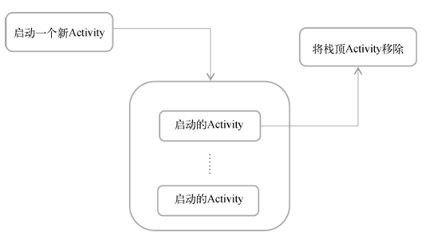
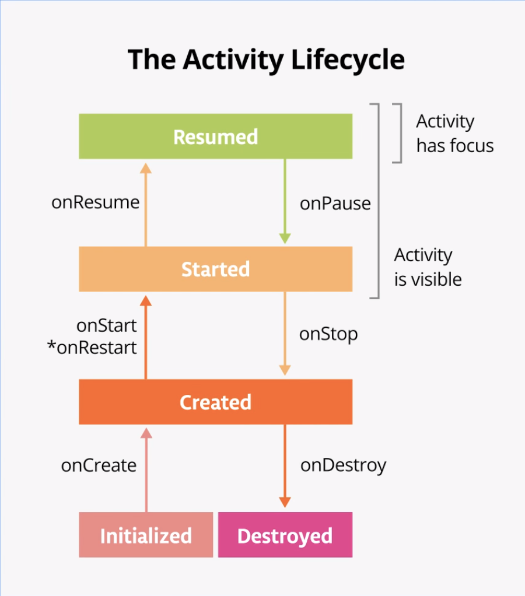

## Activity 组件

### 什么是 Activity 组件

Activity是最容易吸引用户的地方，它是一种可以包含用户界面的组件，主要用于和用户进行交互。

Activity 是 Android 应用的一个基本组件，代表应用中的一个屏幕。每个 Activity 都包含用户界面和用户交互的逻辑。在不同的Activity之间进行切换形成应用的不同界面。

## Activity 的生命周期

### 返回栈

Android中的Activity是可以层叠的。我们每启动一个新的Activity，就会覆盖在原Activity之上，然后点击Back键会销毁最上面的Activity，下面的一个Activity就会重新显示出来。Android是使用任务（task）来管理Activity的，一个任务就是一组存放在栈里的Activity 的集合，这个栈也被称作返回栈（back stack）。

栈是一种后进先出的数据结构，在默认情况 下，每当我们启动了一个新的Activity，它就会在返回栈中入栈，并处于栈顶的位置。而每当我 们按下Back键或调用finish()方法去销毁一个Activity时，处于栈顶的Activity就会出栈，前 一个入栈的Activity就会重新处于栈顶的位置。**系统总是会显示处于栈顶的Activity给用户**。

### Activity 的生存期

Activity 类中定义了 7 个回调方法，覆盖了 Activity 生命周期的每一个环节。Android 会在 activity 从一种状态切换为另一种状态时调用这些回调，而您可以在自己的 activity 中替换这些方法，通过执行任务来响应这些生命周期状态变化。下图显示了生命周期状态以及可用的可替换回调。

> `onRestart()` 方法上的星号表示，每次状态在 **Created** 和 **Started** 之间转换时，系统都不会调用此方法。仅当调用 `onStop()` 并且随后重启 activity 时，系统才会调用此方法。

在应用启动并且系统调用 `onStart()` 后，该应用将在屏幕上变得可见。当系统调用 `onResume()` 时，应用会获得用户焦点，即用户可以与应用交互。应用在屏幕上完全显示并且具有用户焦点的这部分生命周期称为[前台生命周期](https://developer.android.google.cn/reference/android/app/Activity?hl=zh-cn#activity-lifecycle)。当应用进入后台后，焦点在 `onPause()` 后便会丢失，并且在 `onStop()` 后，该应用将不再可见。

**区分焦点与可见性之间的差异很重要**。某个 activity 有可能在屏幕上部分可见，但没有用户焦点。

在此用例中，系统没有调用 `onStop()`，因为相应 activity 仍然部分可见。但是，该 activity 没有用户焦点，并且用户无法与之交互；位于前台的“共享”activity 具有用户焦点。为什么这种区别至关重要？单纯的 `onPause()` 导致的中断通常仅持续很短的时间，然后用户就会返回您的 activity，或者导航到另一个 activity 或应用。通常，您需要持续更新界面，使应用的其余部分不会卡顿。在 `onPause()` 中运行的任何代码都会阻止其他内容显示，因此请使 `onPause()` 中的代码保持轻量级。例如，当有来电时，`onPause()` 中的代码可能会延迟来电通知。

`onResume()` 和 `onPause()` 都必须处理焦点。当相应 activity 获得焦点时，系统会调用 `onResume()` 方法；当该 activity 失去焦点时，系统会调用 `onPause()`。

### 回调方法

activity 生命周期中的每种状态都有一个对应的回调方法，您可以在 `Activity` 类中替换此类方法。核心的生命周期方法集合包括：[`onCreate()`](https://developer.android.google.cn/reference/android/app/Activity.html?hl=zh-cn#onCreate(android.os.Bundle))、[`onRestart()`](https://developer.android.google.cn/reference/android/app/Activity.html?hl=zh-cn#onRestart())、[`onStart()`](https://developer.android.google.cn/reference/android/app/Activity.html?hl=zh-cn#onStart())、[`onResume()`](https://developer.android.google.cn/reference/android/app/Activity.html?hl=zh-cn#onResume())、[`onPause()`](https://developer.android.google.cn/reference/android/app/Activity.html?hl=zh-cn#onPause())、[`onStop()`](https://developer.android.google.cn/reference/android/app/Activity.html?hl=zh-cn#onStop())、[`onDestroy()`](https://developer.android.google.cn/reference/android/app/Activity.html?hl=zh-cn#onDestroy())。

`onCreate()` 和 `onDestroy()` 在单个 activity 实例的生命周期内只会调用一次：`onCreate()` 用于首次初始化应用，`onDestroy()` 用于作废、关闭或销毁 activity 可能一直在使用的对象，使其不会继续使用资源（如内存）。

- `onStart()`：系统会在调用 `onCreate()` 之后立即调用 `onStart()` 生命周期方法。`onStart()` 运行后，您的 activity 会显示在屏幕上。与为初始化 activity 而仅调用一次的 `onCreate()` 不同，`onStart()` 可在 activity 的生命周期内由系统多次调用。
- `onRestart()` 只有在 activity 已经创建之后才会被系统调用，并且会在系统调用 `onStop()` 时最终进入 **Created** 状态，但是会返回 **Started** 状态，而不是进入 **Destroyed** 状态。`onRestart()` 方法用于放置仅在 activity **不**是首次启动时才需要调用的代码。

如果您的代码手动调用 activity 的 [`finish()`](https://developer.android.google.cn/reference/android/app/Activity.html?hl=zh-cn#finish()) 方法，或者用户强制退出应用，Android OS 可能会关闭该 activity。

### 配置变更

**配置变更会影响 activity 生命周期。**

当设备的状态发生了根本性改变，**以至于系统解决改变的最简单方式就是完全关闭并重建 activity 时，就会发生配置变更。**例如，如果用户更改了设备语言，整个布局可能就需要更改为适应不同的文本方向和字符串长度。如果用户将设备插入基座或添加物理键盘，应用布局可能需要利用不同的显示大小或布局。如果设备屏幕方向发生变化，比如设备从竖屏旋转为横屏或反过来，布局可能需要改为适应新的屏幕方向。让我们看看应用在这种情况下的行为。

屏幕旋转是导致 activity 关闭并重启的一种配置变更类型。当设备旋转，而相应 activity 被关闭并重新创建时，该 activity 会使用默认值重新启动 - 甜点图片、已售甜点的数量和总收入会重置为零。为了避免重置，使用重组。

> 如需保存需要在配置更改后继续存在的值（让 Compose 在配置更改期间保留状态），您必须使用 `rememberSaveable` 或者  [`ViewModel`](https://developer.android.google.cn/topic/libraries/architecture/viewmodel?hl=zh-cn)。

## Activity 的启动模式