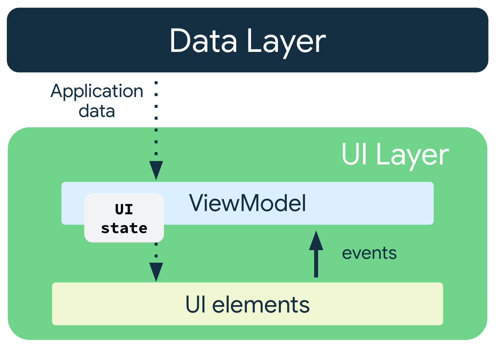

## 应用架构

应用架构是指一组应用设计规则。就像房屋的蓝图一样，架构为应用提供了结构。良好的应用架构能让代码在未来几年内始终保持可靠性、灵活性、可伸缩性、可测试性和可维护性。[应用架构指南](https://developer.android.google.cn/topic/libraries/architecture?hl=zh-cn)提供了有关应用架构的建议和推荐的最佳实践。

### 背景

### 设计原则

1. **分离关注点**：将应用分为函数类，每个类都有各自的责任。通过将数据与界面代码放在不同的层中，您可以在代码的某一部分进行更改，而不会影响其他部分。
   - 可组合函数与 ViewModel 交互，ViewModel 与代码库交互。这是一种很好的设计原则，原因在于对代码库的更改不需要您更改可组合函数，因为它们不会直接交互。

2. **通过模型驱动界面**：应该通过模型驱动界面，最好是通过持久性模型。模型是负责处理应用数据的组件。它们独立于应用中的界面元素和应用组件，因此不受应用的生命周期以及相关的关注点的影响。

整体上尽量将代码放入不依赖 Android API 的类中。这样单元测试更简单。

分层架构 

- UI 层
- 数据层，
- UI 层和数据层的通讯模式：单向数据流模式 UDF

UI/ System events

## 分层架构

根据 [Android 的推荐应用架构](https://developer.android.google.cn/topic/architecture?hl=zh-cn#recommended-app-arch)，应用应至少具有一个界面层和一个数据层。

- **界面层：**在屏幕上显示应用数据但独立于数据的层。
- **数据层：**用于存储、检索和提供应用数据的层。
- **网域层(可选)**: 简化和重复使用界面层与数据层之间的交互

### 界面层

界面层（或表示层）的作用是**在屏幕上显示应用数据**。每当数据因用户互动（例如按了某个按钮）而发生变化时，界面都应随之更新，以反映这些变化。

界面层由以下组件组成：

- **界面元素：**用于在屏幕上呈现数据的组件。您将使用 [Jetpack Compose](https://developer.android.google.cn/jetpack/compose?hl=zh-cn) 构建这些元素。
- **状态容器：**用于保存数据、向界面提供数据以及处理应用逻辑的组件。状态容器的一个示例为 [ViewModel](https://developer.android.google.cn/topic/libraries/architecture/viewmodel?hl=zh-cn)。

界面是将屏幕上的界面元素与界面状态绑定在一起的结果。**界面是相对用户而言的，而界面状态是相对应用而言的**。界面是界面状态的直观呈现。对界面状态所做的任何更改都会立即反映在界面中。

通常而言，**建议界面状态定义是不可变的**。不可变对象可保证多个来源不会即时更改应用的状态。这种保护机制让界面可以专注于发挥单一作用：读取状态并相应地更新其界面元素。因此，切勿直接在界面中修改界面状态，除非界面本身是其数据的唯一来源。违反这个原则会导致同一条信息有多个可信来源，从而导致数据不一致和轻微的 bug。

UI 怎么知道 UI state 发生变化？关键在可观测数据，[`StateFlow`](https://kotlin.github.io/kotlinx.coroutines/kotlinx-coroutines-core/kotlinx.coroutines.flow/-state-flow/)

### 数据层

数据层负责应用的业务逻辑以及为应用寻源和保存数据。数据层使用[单向数据流](https://developer.android.google.cn/topic/architecture?hl=zh-cn#unidirectional-data-flow)模式向界面层公开数据。数据可能来自多个来源，例如网络请求、本地数据库或设备上的文件

>  数据层是存储、管理应用数据，以及提供对数据的访问权限

一个应用甚至可能有多个数据源。当应用打开时，它会从设备上的本地数据库（第一个来源）检索数据。当应用运行时，它会向第二个来源发出网络请求以检索较新的数据。数据层由一个或多个仓库组成。仓库本身包含零个或多个数据源。按照最佳实践，您应为应用所使用的每种数据源类型都提供一个仓库。

通常，仓库类的作用包括：

- 向应用的其余部分公开数据。
- 集中管理数据更改。
- 解决多个数据源之间的冲突。
- 对应用其余部分的数据源进行抽象化处理。
- 存放业务逻辑。

Android 开发者指南指出，仓库类以其所负责的数据命名。[仓库命名惯例](https://developer.android.google.cn/topic/architecture/data-layer?hl=zh-cn#naming-conventions)是**数据类型 + 仓库**。

[添加仓库和手动依赖项注入	](https://developer.android.google.cn/codelabs/basic-android-kotlin-compose-add-repository?hl=zh-cn&continue=https%3A%2F%2Fdeveloper.android.google.cn%2Fcourses%2Fpathways%2Fandroid-basics-compose-unit-5-pathway-2%3Fhl%3Dzh-cn%23codelab-https%3A%2F%2Fdeveloper.android.com%2Fcodelabs%2Fbasic-android-kotlin-compose-add-repository#1)

### 单向数据流模式

单向数据流 (UDF) 是一种设计模式，在该模式下，状态向下流动，事件向上流动。通过遵循单向数据流，您可以将在界面中显示状态的可组合函数与应用中存储和更改状态的部分解耦。

使用单向数据流的应用的界面更新循环如下所示：

- **事件：**界面的某一部分生成一个事件，并将其向上传递，例如将按钮点击传递给 ViewModel 进行处理；或者从应用的其他层传递事件，如指示用户会话已过期。
- **更新状态：**事件处理脚本可能会更改状态。
- **显示状态：**状态容器向下传递状态，而界面会显示此状态。

在应用架构中使用 UDF 模式会产生以下影响：

- `ViewModel` 会存储并公开界面所使用的状态。
- 界面状态是经过 `ViewModel` 转换的应用数据。
- 界面会向 `ViewModel` 发送用户事件通知。
- `ViewModel` 会处理用户操作并更新状态。
- 更新后的状态将反馈给界面以进行呈现。
- 系统会对导致状态更改的所有事件重复此流程。

## Dao 层和仓库层的区别

-  DAO（Data Access Object）：负责与数据源（通常是本地数据库如 Room）交互，定义对数据库的增删改查操作
- Repository（存储库）：作为数据的中控层，统一管理数据来源（如本地数据库、网络 API、内存缓存等），对外提供统一的数据访问接口。特点：
  - 不直接操作数据，而是协调多个数据源。
  - 决定数据是从本地数据库获取，还是需要从网络拉取。
  - 可以包含业务逻辑。
  - 通常被 ViewModel 调用。

## 参考资料

- [应用架构指南 | Android 开发者](https://developer.android.google.cn/topic/architecture?hl=zh-cn)
- [界面层 | Android 开发者](https://developer.android.google.cn/topic/architecture/ui-layer?hl=zh-cn)
- [使用单向数据流管理状态 | Android 开发者](https://developer.android.google.cn/topic/architecture/ui-layer?hl=zh-cn#udf)
- 学习在线课程：[现代 Android 应用架构](https://developer.android.google.cn/courses/pathways/android-architecture?hl=zh-cn)
- [架构组件  | Android Basics Compose - Architecture Components  | Android Developers](https://developer.android.google.cn/courses/pathways/android-basics-compose-unit-4-pathway-1?hl=zh-cn)