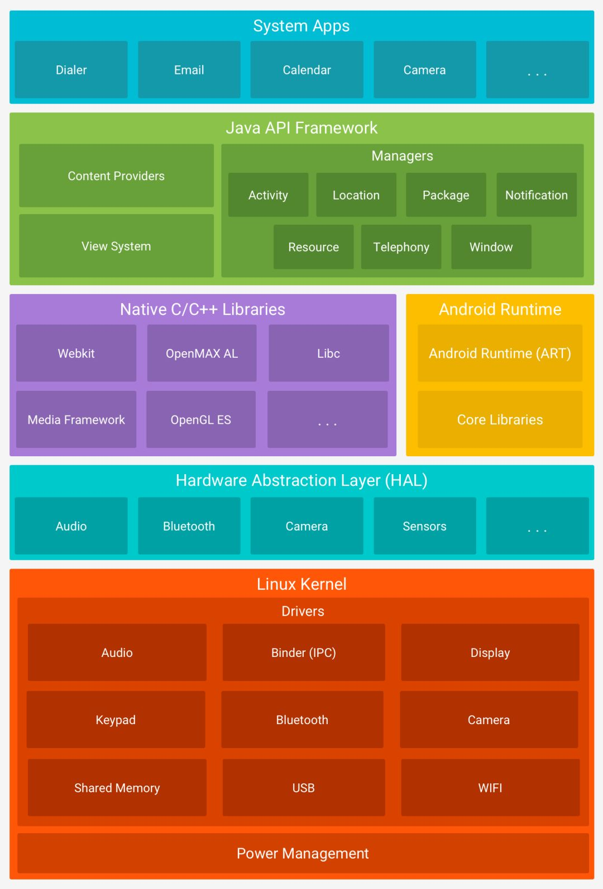
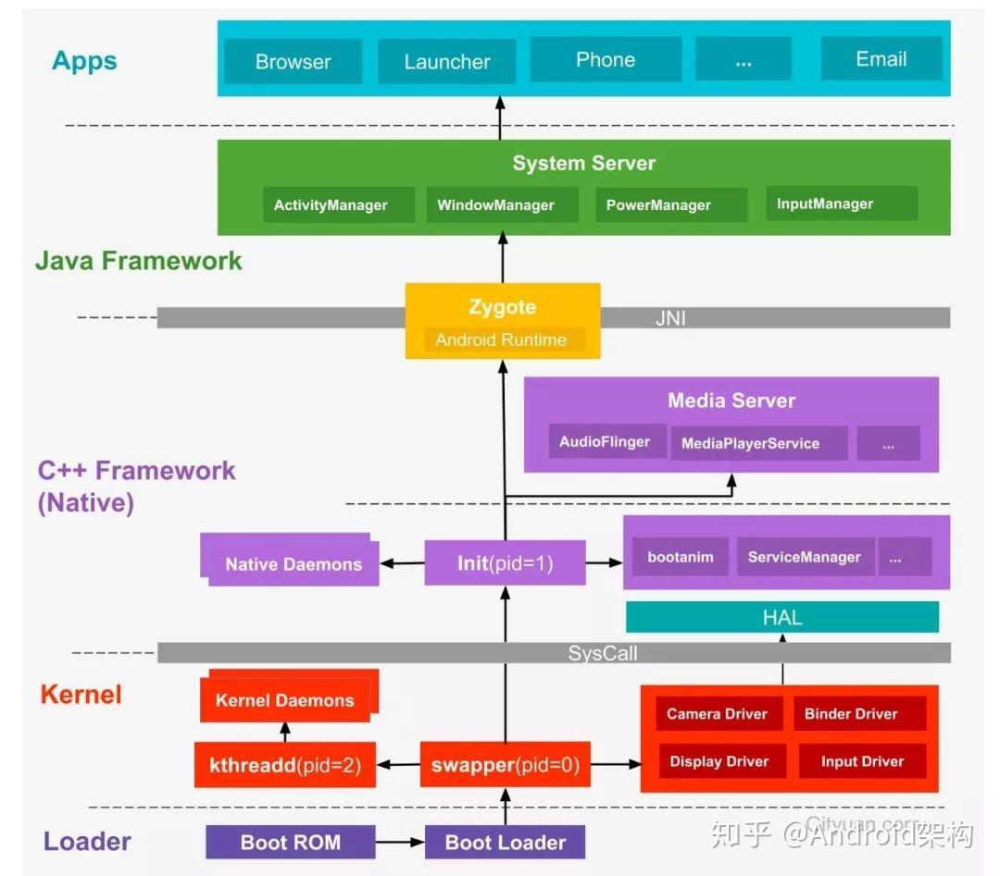
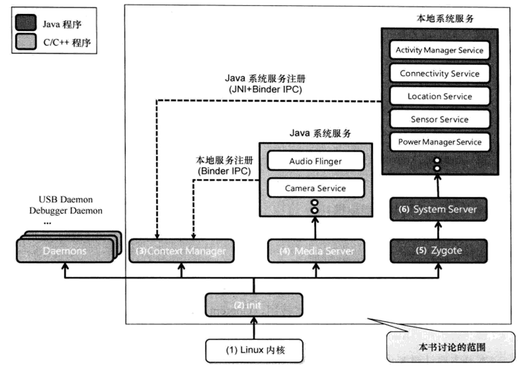
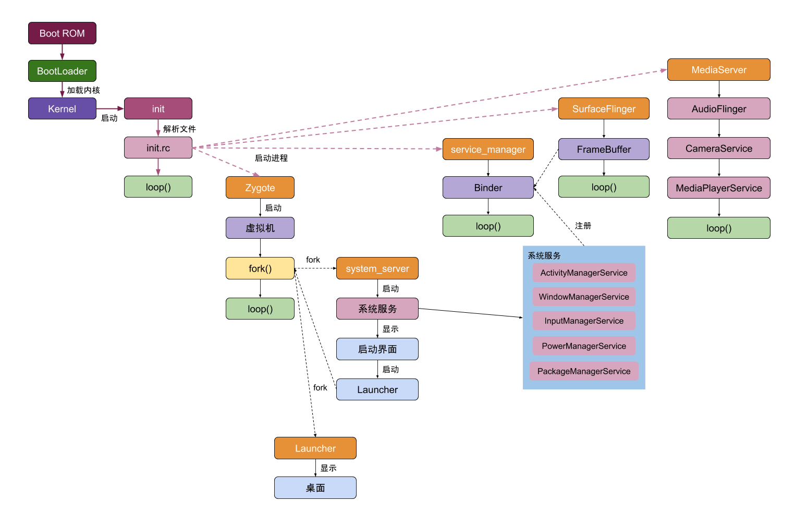

## 一、Android 系统架构

Android底层内核空间以Linux Kernel作为基石，上层用户空间由Native系统库、虚拟机运行环境、框架层组成，通过[系统调用](https://zhida.zhihu.com/search?content_id=117107499&content_type=Article&match_order=1&q=系统调用&zhida_source=entity)(Syscall)连通系统的[内核空间](https://zhida.zhihu.com/search?content_id=117107499&content_type=Article&match_order=2&q=内核空间&zhida_source=entity)与用户空间。对于用户空间主要采用C++和Java代码编写，通过JNI技术打通用户空间的Java层和Native层(C++/C)，从而连通整个系统。

### Android 经典分层架构

Google官方提供的经典分层架构图，从下往上依次分为Linux内核、HAL、系统Native库和Android运行时环境、Java框架层以及应用层这5层架构，其中每一层都包含大量的子模块或子系统。

Android 采用 **分层架构**，主要分为：

- **Linux 内核层**：提供硬件驱动、内存管理、进程管理等底层支持。
- **硬件抽象层（HAL）**: 让厂商可以适配不同硬件（如摄像头、传感器）。
- **Android Runtime（ART）**: 负责运行 APP。
- **原生 C/C++ 库**：提供 OpenGL、SQLite、WebKit 等功能。
- **Java API 框架** : 提供开发 Android App 的 API（如 `Activity`、`Service`）。
- **系统应用层**：包括电话、短信、设置等默认APP。

### AOSP 的软件堆栈

引用 [架构概览  | Android Open Source Project](https://source.android.com/docs/core/architecture?hl=zh-cn) 中的图片，AOSP 的软件堆栈包含以下层：

## 二、Android 系统启动流程— 架构视角

以进程的视角，以分层的架构来诠释Android系统的全貌

[(5 封私信 / 64 条消息) 一文带你掌握 Android 系统架构 - 知乎](https://zhuanlan.zhihu.com/p/130392136)

## 一、Android 系统启动过程-简略版 服务视角

引用《Android框架揭秘》中的图片。

注意，图中**本地系统服务（Native System Services）** 和 **Java 系统服务（Java System Services）**标错了。

这仅仅是Android 启动过程的一部分，当所有Java 系统服务加载完毕后，ActivityManager Service 会运行 HOME应用，启动过程继续进行。

### 1.1 Linux 内核

Android 是基于 Linux 内核的系统平台。启动时，首先通过 bootloader (系统加载器)，加载 Linux 内核。在 Linux 加载启动时，与普通的 Linux 启动过程相同，先初始化内核，然后调用init 进程。

### 1.2 init 进程

Android init 进程对各种设备进行初始化，运行 Android Framework 所需用的各种 Daemon、Context Manager、Media Server、Zygote 等。

以下是 init 进程执行的 Daemon 进程。

- USB Daemon(usbd): 管理USB 连接
- Android Debug Bridge Daemon (adbd):  Android Debug Bridge 连接管理。
- Debugger Daemon(debuggerd): 启动 Debugger 系统
- Radio Interface Layer Daemon(rild): 管理无线通信连接。

### 1.3 Context Manager 进程

Context Manager 是 Android 系统中负责管理系统服务（System Services）的核心进程。系统服务是 Android Framework 的重要组成部分，为应用程序提供关键功能，如相机、音频、视频处理等 API。

Context Manager 主要功能有：

- **系统服务注册与管理**：
  - **在系统启动时，所有系统服务需向 Context Manager 注册其 handle（服务标识符）。**
  - Context Manager 维护这些服务的运行时信息，供应用程序或 Framework 模块查询和调用。

- **服务调用中介:**
  - 在调用系统服务时，应用程序或 Framework 模块需先向 Context Manager 申请目标服务，再通过 **Binder IPC（进程间通信）** 调用该服务。
  - Binder IPC 是 Android 实现跨进程通信（Inter-Process Communication, IPC）的核心机制。

### 1.4 Media Server

Media Server 用于运行基于 C/C++ 的本地系统服务，如 Audio Flinger (负责音频输出)、Camera 等。

### 1.5 Zygote

**Zygote 进程用于缩短 Android 应用程序加载的时间**。每当执行 Java 应用程序时，Zygote 就会派生出一个子进程来执行应用程序，该子进程就是用来执行 Java 应用程序的虚拟机。

### 1.6 System Server

System Server 是 Android 系统的核心进程，由 **Zygote** 进程在系统启动时创建，负责初始化和运行大部分 **Java 系统服务**，如：

- **ActivityManagerService (AMS)**：管理应用程序生命周期。
- **LocationManagerService**：提供设备地理位置信息。
- **WindowManagerService (WMS)**：管理窗口和界面交互。
- **PackageManagerService (PMS)**：处理应用安装与权限管理。

为了使运行在 System Server 中的 Java 系统服务能够被 **应用程序** 或 **Framework 模块** 调用，需要：

1. **注册到 Service Manager:** Java 系统服务需通过 **Binder IPC** 注册到 **Service Manager**（C 语言实现）
2. **跨语言通信(JNI):** 由于 Service Manager 是 Native 层进程，Java 服务需借助 **JNI（Java Native Interface）** 进行交互。JNI 允许 Java 代码与 C/C++ 编写的底层服务通信.

### 系统服务

在 Android 系统中，系统服务（System Services）可以分为 **本地系统服务（Native System Services）** 和 **Java 系统服务（Java System Services）**，它们在实现方式、运行环境和管理机制上有所不同。

| **特性**     | **本地系统服务（Native）**       | **Java 系统服务（Java）**                     |
| :----------- | :------------------------------- | :-------------------------------------------- |
| **实现语言** | C/C++ （运行在 Native 层）       | Java/Kotlin （运行在 Android Runtime/ART 上） |
| **管理进程** | `servicemanager`（Native 层）    | `SystemServer`（Java 进程）                   |
| **注册方式** | `defaultServiceManager()`        | `ServiceManager.addService()`                 |
| **IPC 机制** | 直接 Binder（`libbinder`）       | AIDL（基于 Binder 的 Java 封装）              |
| **典型服务** | `SurfaceFlinger`, `AudioFlinger` | `AMS`, `WMS`, `PMS`                           |

## Android 系统启动过程-详细版

具体细节查看   [Android-ReadTheFuckingSourceCode/article/android/framework/Android-系统启动过程.md at master · jeanboydev/Android-ReadTheFuckingSourceCode](https://github.com/jeanboydev/Android-ReadTheFuckingSourceCode/blob/master/article/android/framework/Android-系统启动过程.md)

## 三、其他

### Service Manager 和 Context Manager 区别

- **Service Manager**
  - **底层服务中枢**：管理所有 Binder 服务的注册与发现，是 IPC 的核心。
  - **跨语言支持**：Native 和 Java 服务均可注册（但 Java 服务通常通过 `SystemServer` 间接注册）。
- **Context Manager**
  - **应用层接口**：为 App 提供友好的 API（如 `getSystemService()`），隐藏 Binder 细节。
  - **依赖 Service Manager**：实际服务调用仍需通过 Binder 和 `ServiceManager` 完成。

## 参考资料

