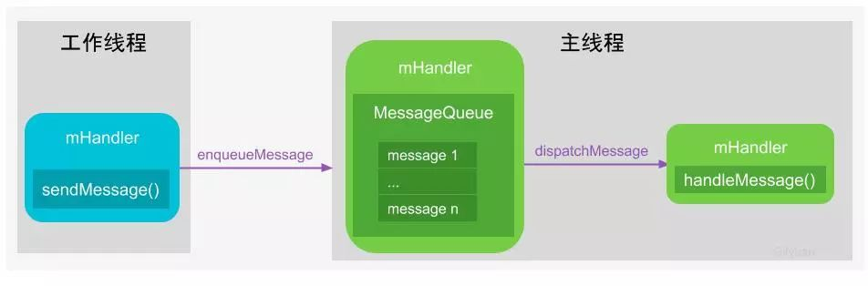

### 什么是 Handler

Handler消息机制用于同进程的线程间通信，Handler消息机制是由一组MessageQueue、Message、Looper、Handler共同组成的。

Handler是工作线程向UI主线程发送消息，即App应用中只有主线程能更新UI，其他工作线程往往是完成相应工作后，通过Handler告知主线程需要做出相应地UI更新操作，Handler分发相应的消息给UI主线程去完成。

由于工作线程与主线程共享地址空间，即Handler实例对象mHandler位于线程间共享的内存堆上，工作线程与主线程都能直接使用该对象，只需要注意多线程的同步问题。工作线程通过mHandler向其成员变量MessageQueue中添加新Message，主线程一直处于loop()方法内，当收到新的Message时按照一定规则分发给相应的handleMessage()方法来处理。所以说，Handler消息机制用于同进程的线程间通信，其核心是线程间共享内存空间

### 为什么不直接使用 Handler 进行线程通信

为何Binder/Socket用于进程间通信，能否用于线程间通信呢？答案是肯定，对于两个具有独立地址空间的进程通信都可以，当然也能用于共享内存空间的两个线程间通信，这就好比杀鸡用牛刀

。接着可能还有人会疑惑，那handler消息机制能否用于进程间通信？答案是不能，Handler只能用于共享内存地址空间的两个线程间通信，即同进程的两个线程间通信。