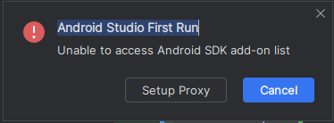

## 一、安装 Android Studio

### 1.1 Ubuntu 安装 Android Studio

在 Linux 上安装 Android Studio，操作步骤如下：

1. 在官网下载 [`.tar.gz` 文件](https://developer.android.google.cn/studio?hl=zh-cn)并解压缩到相应位置，例如 `/usr/local/` 中（用于用户个人资料）或者 `/opt/` 中（用于共享用户）

   ```shell
   # 下载压缩包
   wget https://redirector.gvt1.com/edgedl/android/studio/ide-zips/2024.3.2.15/android-studio-2024.3.2.15-linux.tar.gz
   
   # 解压到 /usr/local/
   sudo tar -xzf android-studio-*.tar.gz -C /usr/local/
   ```

   对于 64 位版本的 Linux，请先安装 [64 位计算机所需的库](https://developer.android.google.cn/studio/install?hl=zh-cn#64bit-libs)。

   ```shell
   sudo apt-get install libc6:i386 libncurses5:i386 libstdc++6:i386 lib32z1 libbz2-1.0:i386
   ```

2. 打开终端，进入 `android-studio/bin/` 目录，执行 `studio.sh`来启动 Android Studio

   ```shell
   cd /usr/local/android-studio/bin/
   ./studio.sh
   ```

3. 选择是否要导入之前的 Android Studio 设置，然后点击 **OK**

4. Android Studio **设置向导**会引导您完成其余设置，其中包括下载开发所需的 Android SDK 组件。建议直接选择 Standard 安装类型。


### 1.2 安装信息

在安装过程中，standard 安装类型的信息如下：

```
Setup Type:
Standard
SDK Folder:
/home/zouhu/Android/Sdk
Total Download Size:
2.29 GB
SDK Components to Download:
Android Emulator
  
287 MB

Android SDK Build-Tools 35.0.1
  
59.1 MB

Android SDK Build-Tools 36
  
60.8 MB

Android SDK Platform 35
  
61.3 MB

Android SDK Platform-Tools
  
7.13 MB

Google Play Intel x86_64 Atom System Image
  
1.78 GB

Sources for Android 35
  
46.4 MB
```


### 1.3 安装过程中的问题

#### 代理问题

安装过程中遇到 Android Studio First Run —— Unable to access Android SDK add-on list，




在点击Setup Proxy 后， 配置代理：

1. 选择 Manual proxy configuration
2. 配置host name 为 `mirrors.aliyun.com`， 端口号为 80


### 卸载 Android Studio

```
# 打开终端，进入 Android Studio 的安装目录
root su
cd /usr/local/android-studio

# 运行卸载脚本
./bin/uninstall.sh
```


## 二、配置 Android Studio

### 2.1 创建桌面应用图标

如需使 Android Studio 出现在应用列表中，从 Android Studio 菜单栏中依次选择 **Tools > Create Desktop Entry**。

https://youtrack.jetbrains.com/articles/SUPPORT-A-56/How-to-handle-Switch-to-a-native-launcher-notification


## 参考资料

[安装 Android Studio 官方教程](https://developer.android.google.cn/studio/install?hl=zh-cn)

