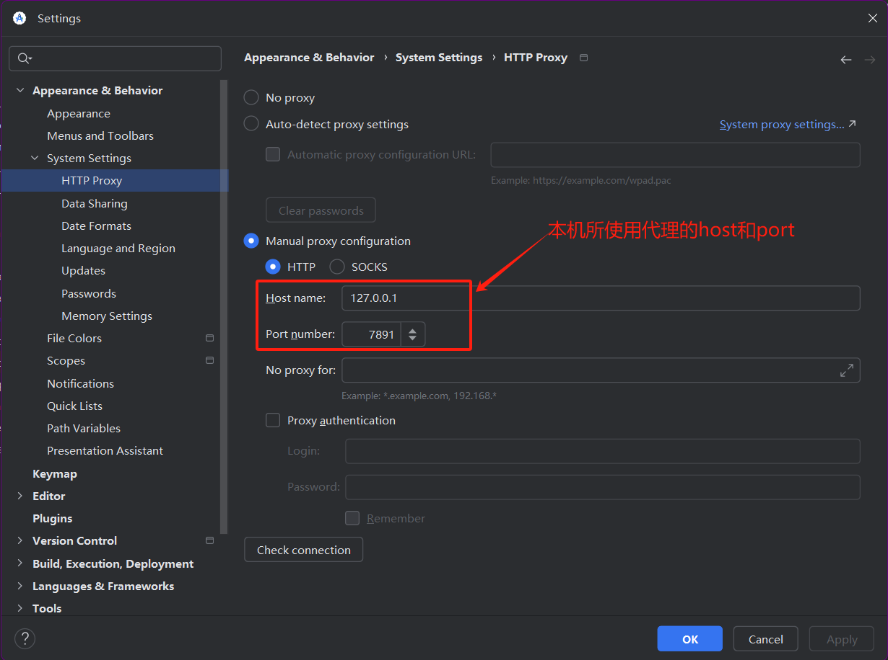
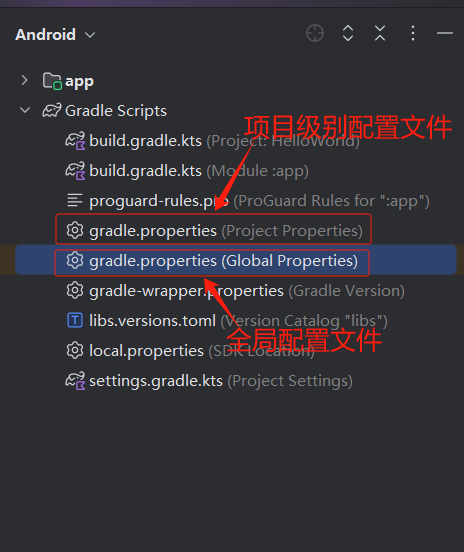
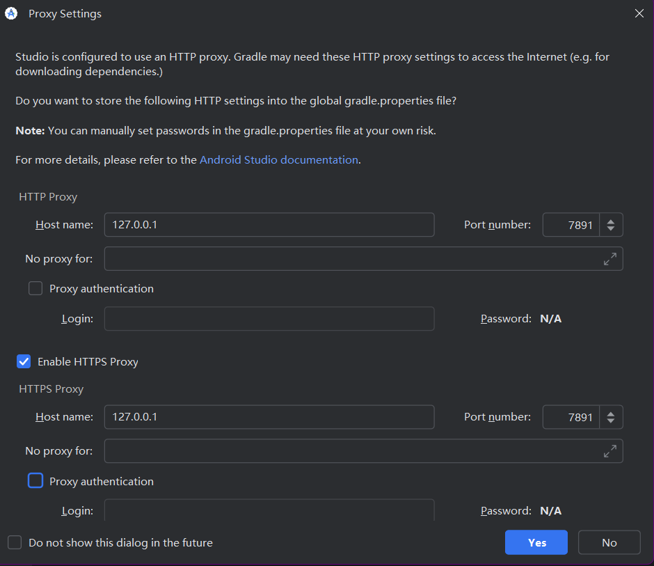

## 配置 Android Studio 代理

[**Android Studio 代理**](https://www.jetbrains.com/help/idea/2024.3/settings-http-proxy.html?http.proxy&keymap=Windows)是用来控制 IDE 自身网络请求（如 SDK 下载）。配置步骤如下：

1. 打开 `File > Settings > Appearance & Behavior > System Settings > HTTP Proxy`。
2. 选择代理模式，填写代理信息。
   - **自动检测代理设置**： 勾选 Auto-detect proxy settings。 系统会根据操作系统的网络配置自动检测代理。

     > Android Studio/Gradle 的“自动检测代理”功能依赖系统的 **Internet 选项**（Windows）或 **网络设置**（macOS/Linux），而 Clash 默认不修改这些配置。如果我们想使用 clash 的话，应该手动配置代理。

   - **手动配置代理**： 勾选 Manual proxy configuration。 填写以下信息： Proxy host name：输入代理服务器地址（如 mirrors.aliyun.com）。 Port：输入端口号（如 80）。 如果需要身份验证，勾选 Authentication 并填写用户名和密码。



Android Studio 代理推荐：

```
Android SDK在线更新镜像服务器
1.阿里云镜像站地址：
mirrors.aliyun.com 端口：80
2.清华大学镜像站地址：
mirrors.tuna.tsinghua.edu.cn 端口：80
3.北京外国语大学镜像站地址：
mirror.bfsu.edu.cn 端口：80
4.中国科学院开源协会镜像站地址:
IPV4/IPV6: mirrors.opencas.cn 端口：80IPV4/IPV6: mirrors.opencas.org 端口：80IPV4/IPV6: mirrors.opencas.ac.cn 端口：80
5.上海GDG镜像服务器地址:
sdk.gdgshanghai.com 端口：8000
6.北京化工大学镜像服务器地址:
IPv4: ubuntu.buct.edu.cn/ 端口：80IPv4: ubuntu.buct.cn/ 端口：80IPv6: ubuntu.buct6.edu.cn/ 端口：80
7.大连东软信息学院镜像服务器地址:
mirrors.neusoft.edu.cn 端口：80
8.腾讯Bugly 镜像:
android-mirror.bugly.qq.com 端口：8080
```


## 配置 Gradle 代理

**Gradle 代理**是用来控制项目构建时的依赖下载。配置步骤如下：

1. **定位配置文件**：
- 如果只对当前项目生效，修改项目根目录下的 `gradle.properties` 文件。
  
- 如果希望全局生效，修改用户目录下的`C:\Users\<用户名>\.gradle\gradle.properties` 文件。

​      事实上，我们可以在 Android Studio 的文件中找到这两个文件。



2. **修改配置文件**：在文件中添加以下内容：

   ```properties
   # 设置 http 和 https 请求的代理
   systemProp.http.proxyHost=xx.xx.xx.xx
   systemProp.http.proxyPort=xxxx
   systemProp.https.proxyHost=xx.xx.xx.xx
   systemProp.https.proxyPort=xxxx
   
   # 如果有身份验证，填写用户名和密码
   systemProp.http.proxyUser=your_username
   systemProp.http.proxyPassword=your_password
   
   # 绕过代理的地址（可选）
   systemProp.http.nonProxyHosts=*.nonproxydomains.com|localhost
   ```

   如果使用 Clash ，我们可以添加如下内容：

   ```
   # HTTP/HTTPS 代理
   systemProp.http.proxyHost=127.0.0.1
   systemProp.http.proxyPort=7890
   systemProp.https.proxyHost=127.0.0.1
   systemProp.https.proxyPort=7890
   ```

   在修改配置后，IDE 会弹出下图所示界面

   


## 总结

在 Android 开发中，**Android Studio 代理** 和 **Gradle 代理** 虽然都涉及网络请求的代理配置，但它们的生效范围和配置方式不同。

| **配置项**   | **Android Studio 代理**                                      | **Gradle 代理**                                              |
| :----------- | :----------------------------------------------------------- | :----------------------------------------------------------- |
| **影响对象** | Android Studio IDE 自身的网络请求（如 SDK 下载、插件更新等） | Gradle 构建过程中的网络请求（如依赖下载、插件下载等）        |
| **生效场景** | - IDE 界面操作（如 SDK Manager、插件市场） - 项目创建/导入时的初始配置 | - 执行 Gradle 构建任务（如 `./gradlew build`） - 同步项目时下载依赖 |
| **典型问题** | 无法下载 SDK、无法更新插件                                   | 构建失败，报错 `Could not resolve xxx`                       |