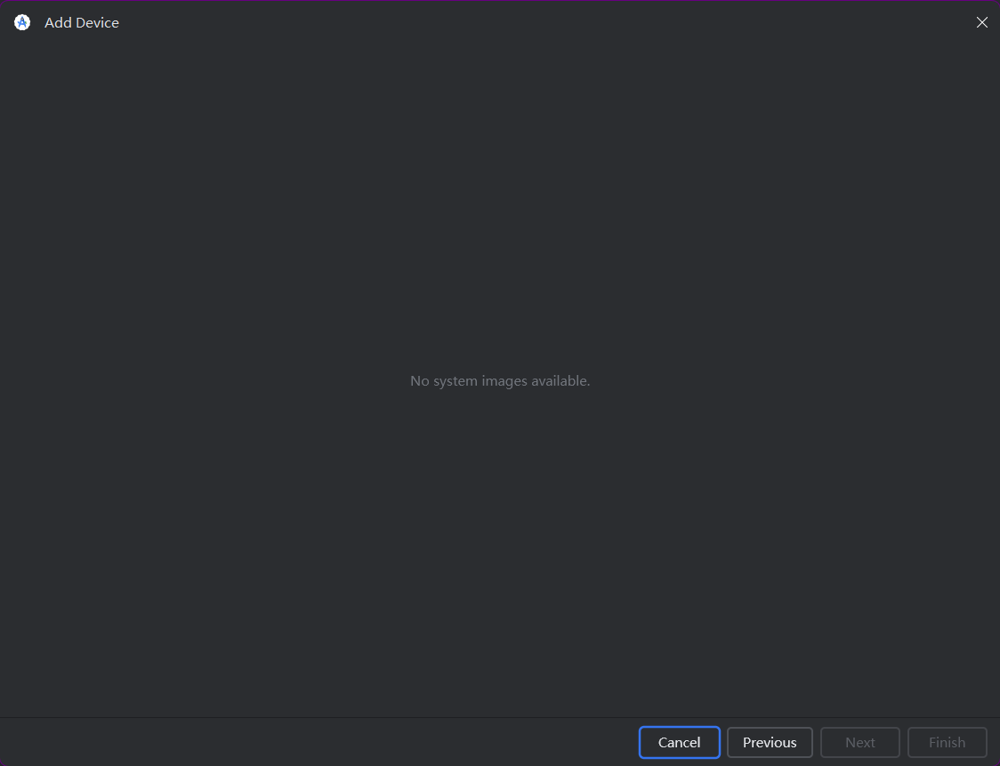
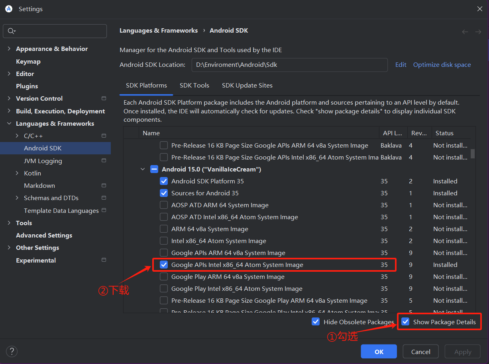
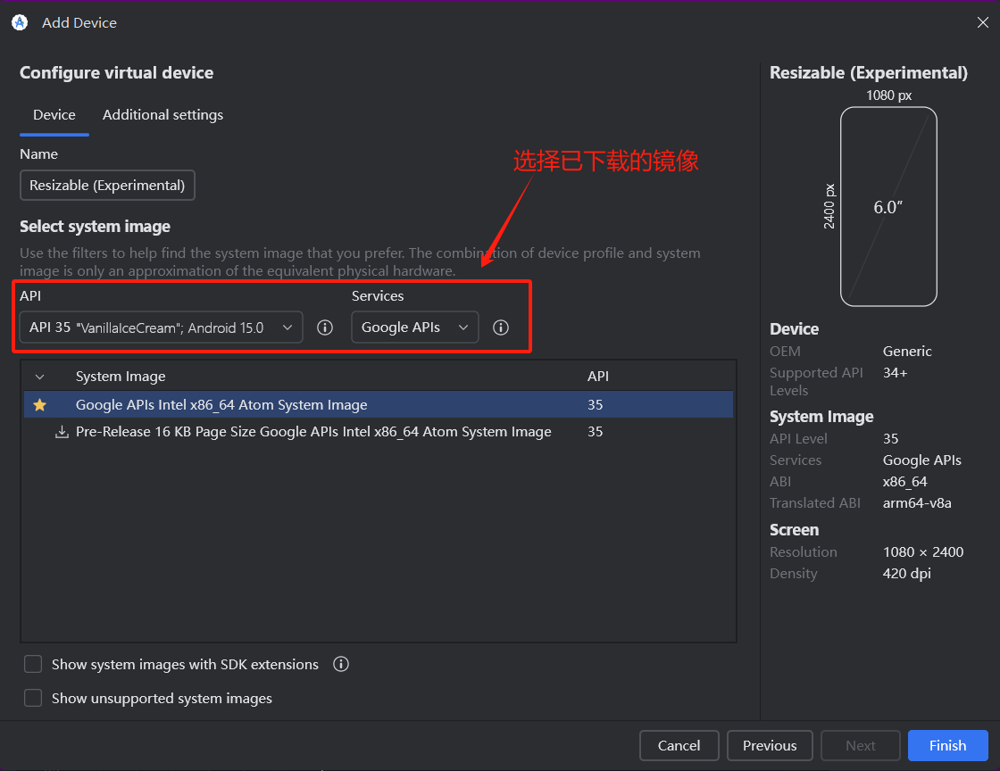
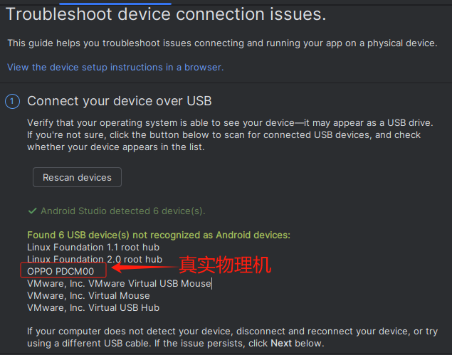

## 模拟器无法启动

### 问题描述

在 Windows 系统中，启动安卓模拟器，报如下错误：

```
Unable to launch Pixel 2 API 30 - The emulator process for AVD Pixel_2_API_30 has terminated.
```


### 原因分析

打开 `C:\Users\zouhu\AppData\Local\Google\AndroidStudio2024.3.2\log` 日志文件

```log
2025-06-27 23:23:30,223 [1113189]   INFO - Emulator: Pixel 2 API 30 - D:\Enviroment\Android\Sdk\emulator\emulator.exe -netdelay none -netspeed full -studio-params C:\Users\zouhu\AppData\Local\Temp\emu10.tmp -avd Pixel_2_API_30 -qt-hide-window -grpc-use-token -idle-grpc-timeout 300
2025-06-27 23:23:30,317 [1113283]   INFO - Emulator: Pixel 2 API 30 - Android emulator version 35.6.11.0 (build_id 13610412) (CL:N/A)
2025-06-27 23:23:30,317 [1113283]   INFO - Emulator: Pixel 2 API 30 - Graphics backend: gfxstream
2025-06-27 23:23:30,317 [1113283]   INFO - Emulator: Pixel 2 API 30 - Found systemPath D:\Enviroment\Android\Sdk\system-images\android-30\google_apis_playstore\x86\
2025-06-27 23:23:30,317 [1113283]   INFO - Emulator: Pixel 2 API 30 - Found systemPath D:\Enviroment\Android\Sdk\system-images\android-30\google_apis_playstore\x86\
2025-06-27 23:23:31,593 [1114559]   WARN - Emulator: Pixel 2 API 30 - Please update the emulator to one that supports the feature(s): Vulkan
2025-06-27 23:23:31,593 [1114559]   INFO - Emulator: Pixel 2 API 30 - Increasing RAM size to 2048MB
2025-06-27 23:23:31,593 [1114559]   INFO - Emulator: Pixel 2 API 30 - IPv4 server found: 8.8.8.8
2025-06-27 23:23:31,593 [1114559]   INFO - Emulator: Pixel 2 API 30 - Ignore IPv6 address: c042:6ccb:7c01:0:703d:6ccb:7c01:0
2025-06-27 23:23:31,593 [1114559]   INFO - Emulator: Pixel 2 API 30 - Ignore IPv6 address: c042:6ccb:7c01:0:703d:6ccb:7c01:0
2025-06-27 23:23:31,593 [1114559]   INFO - Emulator: Pixel 2 API 30 - Ignore IPv6 address: c042:6ccb:7c01:0:703d:6ccb:7c01:0
2025-06-27 23:23:31,593 [1114559]   INFO - Emulator: Pixel 2 API 30 - Ignore IPv6 address: d857:6ccb:7c01:0:703d:6ccb:7c01:0
2025-06-27 23:23:31,593 [1114559]   INFO - Emulator: Pixel 2 API 30 - Ignore IPv6 address: d857:6ccb:7c01:0:703d:6ccb:7c01:0
2025-06-27 23:23:31,593 [1114559]   INFO - Emulator: Pixel 2 API 30 - Ignore IPv6 address: d857:6ccb:7c01:0:703d:6ccb:7c01:0
2025-06-27 23:23:31,593 [1114559]   INFO - Emulator: Pixel 2 API 30 - Guest GLES Driver: Auto (ext controls)
2025-06-27 23:23:31,593 [1114559]   INFO - Emulator: Pixel 2 API 30 - library_mode host gpu mode host
2025-06-27 23:23:31,593 [1114559]   INFO - Emulator: Pixel 2 API 30 - emuglConfig_get_vulkan_hardware_gpu_support_info: Found physical GPU 'Intel(R) UHD Graphics 630', type: VK_PHYSICAL_DEVICE_TYPE_INTEGRATED_GPU, apiVersion: 1.2.177, driverVersion: 0.402.1472
2025-06-27 23:23:31,593 [1114559]   INFO - Emulator: Pixel 2 API 30 - 
2025-06-27 23:23:31,593 [1114559]   INFO - Emulator: Pixel 2 API 30 - emuglConfig_get_vulkan_hardware_gpu_support_info: Found physical GPU 'Intel(R) UHD Graphics 630', type: VK_PHYSICAL_DEVICE_TYPE_INTEGRATED_GPU, apiVersion: 1.2.177, driverVersion: 0.402.1472
2025-06-27 23:23:31,593 [1114559]   INFO - Emulator: Pixel 2 API 30 - 
2025-06-27 23:23:31,593 [1114559]   INFO - Emulator: Pixel 2 API 30 - emuglConfig_get_vulkan_hardware_gpu_support_info: Found physical GPU 'NVIDIA GeForce GTX 1050', type: VK_PHYSICAL_DEVICE_TYPE_DISCRETE_GPU, apiVersion: 1.3.224, driverVersion: 527.37
2025-06-27 23:23:31,593 [1114559]   INFO - Emulator: Pixel 2 API 30 - 
2025-06-27 23:23:31,593 [1114559]   INFO - Emulator: Pixel 2 API 30 - GPU device local memory = 4232MB
2025-06-27 23:23:31,593 [1114559]   INFO - Emulator: Pixel 2 API 30 - Checking system compatibility:
2025-06-27 23:23:31,593 [1114559]   INFO - Emulator: Pixel 2 API 30 -   Checking: hasCompatibleHypervisor
2025-06-27 23:23:31,593 [1114559]   INFO - Emulator: Pixel 2 API 30 -      Ok: Hypervisor compatibility to run avd: `Pixel_2_API_30` are met
2025-06-27 23:23:31,593 [1114559]   INFO - Emulator: Pixel 2 API 30 -   Checking: hasSufficientSystem
2025-06-27 23:23:31,593 [1114559]   INFO - Emulator: Pixel 2 API 30 -      Ok: System requirements to run avd: `Pixel_2_API_30` are met
2025-06-27 23:23:31,593 [1114559]   INFO - Emulator: Pixel 2 API 30 -   Checking: hasSufficientHwGpu
2025-06-27 23:23:31,593 [1114559]   INFO - Emulator: Pixel 2 API 30 -      Ok: Hardware GPU requirements to run avd: `Pixel_2_API_30` are passed
2025-06-27 23:23:31,593 [1114559]   INFO - Emulator: Pixel 2 API 30 -   Checking: hasSufficientDiskSpace
2025-06-27 23:23:31,593 [1114559]   INFO - Emulator: Pixel 2 API 30 -      Ok: Disk space requirements to run avd: `Pixel_2_API_30` are met
2025-06-27 23:23:31,593 [1114559]   WARN - Emulator: Pixel 2 API 30 - unknown skin name 'pixel_2'
2025-06-27 23:23:31,624 [1114590]   INFO - Emulator: Pixel 2 API 30 - Process finished with exit code 1

```

其中，`D:\Enviroment\Android\Sdk\emulator\emulator.exe -netdelay none -netspeed full -studio-params C:\Users\zouhu\AppData\Local\Temp\emu10.tmp -avd Pixel_2_API_30 -qt-hide-window -grpc-use-token -idle-grpc-timeout 300`  为启动安卓模拟器的命令，`Pixel 2 API 30 - unknown skin name 'pixel_2'` 为错误原因。

AVD 配置中指定的皮肤（`pixel_2`）无效或丢失。皮肤文件通常位于 `$ANDROID_HOME/skins/` 目录下，用于定义设备外观（如边框、按钮等）。这个问题在于AVD 的 `config.ini` 文件中的配置信息出现问题。


### 解决方案

**(1) 修改配置文件**

打开 AVD 的 `config.ini` 文件（路径：`~/.android/avd/Pixel_2_API_30.avd/config.ini`），确认以下行：

```
skin.dynamic=yes
skin.name = pixel_2
skin.path = skins/pixel_2
```

如果 `skin.path` 指向的路径不存在，需修正或者添加这两行（使用默认皮肤）。

（2）**重新指定皮肤**

在 AVD Manager 中编辑设备，将 **Skin** 改为 `None` 或选择其他有效皮肤。在修改完成并启动虚拟设备后，再次修改皮肤为`pixel_2`也可以了，这个时候 `config.ini` 文件已经没有问题。


### 通用检查

以下内容记录常用的一些模拟器出错位置：

[Android Studio安装中虚拟机报错，类似The emulator process for AVD Pixel_8_Pro_APL_35 has terminated的解决办法_the emulator process for avd pixel 8 apl 35 haster-CSDN博客](https://blog.csdn.net/2301_80782594/article/details/142346752)

**(1) 检查 Android Emulator 配置**

**(2) 检查 SDK 工具是否安装成功**

在 SDK Manager 中，查看是否勾选'Android Emulator'选项以及电脑对应的处理器平台

- Intel处理器勾选'Intel x86 Emulator Accelerator(HAXM installer)-Deprecated'

- AMD处理器勾选'Android Emulator Hypervisor Driver (installer)

但是，从 安卓模拟器 33.xxx 开始，HAXM 已废弃，因为 [Intel 已停止开发 HAXM](https://github.com/intel/haxm)。Android Emulator Hypervisor Driver (AEHD) 取代了 Intel 处理器上的 Intel HAXM。具体细节查看[为 Android 模拟器配置硬件加速  | Android Studio  | Android Developers](https://developer.android.google.cn/studio/run/emulator-acceleration?hl=zh-cn#haxm-uninstall)

**（3）检查 Windows 功能**

Windows 上的虚拟机加速可以使用以下两个 Hypervisor 之一：

- Windows Hypervisor Platform (WHPX)
- Android Emulator Hypervisor Driver (AEHD)

注意，WSL2 和 安卓模拟器是兼容的。

**（4）环境变量**

确保环境变量设置正确。在“开始”菜单中搜索“环境变量”，点击“编辑系统环境变量”，然后在“系统变量”栏中点击“新建”，输入变量名*ANDROID_SDK_HOME*，并设置为SDK的安装路径

```
变量名: ANDROID_HOME
变量值: D:\Enviroment\Android\Sdk
```

然后，再添加 `%ANDROID_HOME%\tools`   `%ANDROID_HOME%\tools\bin`、`%ANDROID_HOME%\platform-tools`。

`ANDROID_AVD_HOME`	设置包含所有 AVD 特定文件的目录的路径，这些文件大多包含非常大的磁盘映像。默认位置是 `$ANDROID_EMULATOR_HOME/avd/`。如果默认位置的磁盘空间不足，您可能需要指定新位置。

```
变量名: ANDROID_AVD_HOME
变量值: D:\Enviroment\Android\Sdk\.android\avd
```

环境变量详情参考官网 [环境变量  | Android Studio  | Android Developers](https://developer.android.google.cn/tools/variables?hl=zh-cn)


## 虚拟设备无法下载

### 问题描述

在下载虚拟设备 `Resizable (Experimental)`  的时候，报错 `No systems images available`。




### 原因分析

常见原因：

- 未下载对应 Android 版本的系统镜像
- SDK 平台工具未安装或版本不匹配
- Android Studio 配置的 SDK 路径错误
- 网络问题导致下载失败

经过查找，虚拟设备 `Resizable (Experimental)`  需要 API 34 以上级别，而未下载对应 API 34 以上级别的系统镜像


### 解决方案

(1) 在 Android Studio 中，打开 **Android SDK**，下载符合的镜像。



(2) 重新下载虚拟设备 `Resizable (Experimental)`

可以看到，现在能够正常下载虚拟设备。同时，选择上一步已下载的系统镜像，避免重复下载。




## 虚拟设备找不到

**问题描述**

在虚拟设备的 AVD 文件没有损坏的情况下，Android Studio 无法识别以及导入虚拟设备。


**解决方案**

1. 设置环境变量

   `ANDROID_AVD_HOME`	设置包含所有 AVD 特定文件的目录的路径，这些文件大多包含非常大的磁盘映像。默认位置是 `$ANDROID_EMULATOR_HOME/avd/`。如果默认位置的磁盘空间不足，您可能需要指定新位置。

   ```
   变量名: ANDROID_AVD_HOME
   变量值: D:\Enviroment\Android\Sdk\.android\avd
   ```

   环境变量详情参考官网 [环境变量  | Android Studio  | Android Developers](https://developer.android.google.cn/tools/variables?hl=zh-cn)

2. 重启


## 物理机无法识别

**问题描述**

Android Studio 无法识别到物理机



官方解决方案教程 https://developer.android.com/studio/run/device.html

（1）启动开发者模式和USB调试

打开手机的开发者模式，并在开发者选项中授权USB 调试

- 进入 **「设置」→「关于手机」→「版本号」**（连续点击 7 次开启开发者模式）。
- 返回 **「设置」→「其他设置」→「开发者选项」** → 开启 **USB 调试** 和 **USB 安装**

（2）重启 ADB 服务

在 Android Studio 的 Terminal 中运行：

```
adb kill-server
adb start-server
adb devices
```

