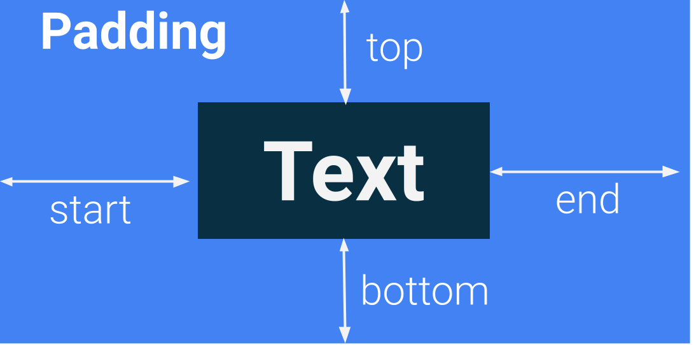
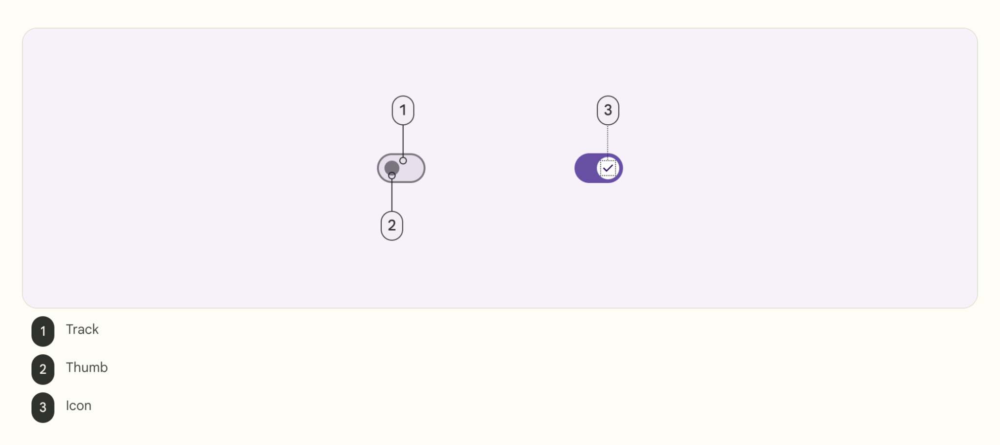
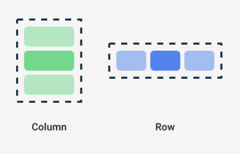
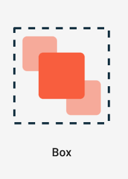
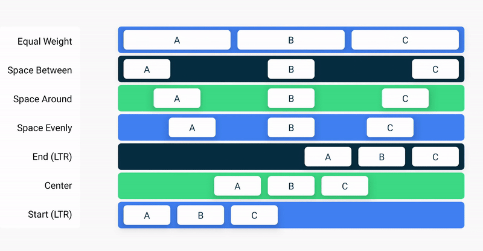

## 基本概念

### 界面 (UI)

应用的界面 (UI) 就是您在屏幕上所看到的内容（文本、图片、按钮和许多其他类型的元素）及其在屏幕上的布局方式。它既是应用向用户显示内容的方式，也是用户与应用展开互动的载体。

 `Text` 元素: 显示文本的界面元素

### 像素

Android 应用中的界面元素使用两种不同的度量单位：

- 一种是您稍后将为布局使用的[密度无关像素 (DP)](https://developer.android.google.cn/reference/kotlin/androidx/compose/ui/unit/package-summary?hl=zh-cn#(kotlin.Int).dp())，

- 另一种就是可缩放像素 (SP)。[更改字体大小](https://developer.android.google.cn/codelabs/basic-android-kotlin-compose-text-composables?hl=zh-cn&continue=https%3A%2F%2Fdeveloper.android.google.cn%2Fcourses%2Fpathways%2Fandroid-basics-compose-unit-1-pathway-3%3Fhl%3Dzh-cn%23codelab-https%3A%2F%2Fdeveloper.android.com%2Fcodelabs%2Fbasic-android-kotlin-compose-text-composables#5) 的使用案例：

  ```
  Text(
      text = message,
      fontSize = 100.sp
  )
  ```

  sp 是 Int 的扩展属性，用于创建 sp 单位。同样，您也可以在 Float 和 Double 等其他数据类型中使用 .sp 扩展属性。

默认情况下，SP 单位与 DP 单位大小相同，但前者的大小会根据用户在手机设置下的首选文本大小进行调整。


### 内边距

界面元素会用自身包裹住其内容。为避免包裹地过紧，您可以在每一侧指定内边距大小。

|  |  |
| ---------------------------------------------------------- | -------------------------------------------------------- |
|                                                            |                                                          |

内边距将作为修饰符使用，这意味着您可以将其应用于任何可组合项。对于可组合项的每一侧，`padding` 修饰符都接受一个可选实参，该实参定义了内边距的大小。




### 样式和主题

样式和主题是一个属性集合，用于指定单个界面元素的外观。样式可以指定某些属性，例如字体颜色、字号、背景颜色等可以应用到整个应用的属性。


## 基本元素

### 虚拟键盘操作按钮

使用相同的 `KeyboardOptions` 设置键盘操作按钮。键盘操作按钮是指键盘端的按钮。

```kotlin
import androidx.compose.ui.text.input.ImeAction


@Composable
fun EditNumberField(
    //...
) {
    TextField(
        //...
        keyboardOptions = KeyboardOptions.Default.copy(
            keyboardType = KeyboardType.Number,
            imeAction = ImeAction.Next
        )
    )
}
```


## 开关

开关可用来开启或关闭单个项的状态。切换开关具有两种状态，可让用户在两个选项之间进行选择。切换开关由滑道、滑块和可选图标组成，如下面这些图片所示：

开关属于选择控件，可用于输入决策或声明偏好设置。用户可以前后拖动滑块来选择所选选项，或者直接点按开关进行切换。如需详细了解开关，请参阅[开关](https://m3.material.io/components/switch/overview)文档。


### 文本字段

- [文本字段 - Material Design 3](https://m3.material.io/components/text-fields/guidelines#5c8a5f07-b1a5-455f-bf76-7ff0d724f6b0)


## 界面层次结构

界面层次结构基于包含机制，意即一个组件可以包含一个或多个组件，有时会用“父级”和“子级”这两个词来表述。这种说法是指，父界面元素包含子界面元素，而子界面元素还可以继续包含子界面元素。在此部分中，您将了解可用作父界面元素的 `Column`、`Row` 和 `Box` 可组合项。


Compose 中的 3 个基本标准布局元素是 [`Column`](https://developer.android.google.cn/reference/kotlin/androidx/compose/foundation/layout/package-summary?hl=zh-cn#Column(androidx.compose.ui.Modifier,androidx.compose.foundation.layout.Arrangement.Vertical,androidx.compose.ui.Alignment.Horizontal,kotlin.Function1))、[`Row`](https://developer.android.google.cn/reference/kotlin/androidx/compose/foundation/layout/package-summary?hl=zh-cn#Row(androidx.compose.ui.Modifier,androidx.compose.foundation.layout.Arrangement.Horizontal,androidx.compose.ui.Alignment.Vertical,kotlin.Function1)) 和 [`Box`](https://developer.android.google.cn/reference/kotlin/androidx/compose/foundation/layout/package-summary?hl=zh-cn#Box(androidx.compose.ui.Modifier,androidx.compose.ui.Alignment,kotlin.Boolean,kotlin.Function1)) 可组合项。`Column`、`Row` 和 `Box` 都是接受可组合内容作为参数的可组合函数，因此您可以在这些布局元素内放置项目。例如，`Row` 可组合项中的各个子元素彼此相邻地水平放置成一行。



```
// Don't copy.
Row {
    Text("First Column")
    Text("Second Column")
}
```


[`Box`](https://developer.android.google.cn/reference/kotlin/androidx/compose/foundation/layout/package-summary?hl=zh-cn#Box(androidx.compose.ui.Modifier,androidx.compose.ui.Alignment,kotlin.Boolean,kotlin.Function1)) 布局是 Compose 中的标准布局元素之一。使用 `Box` 布局可将元素堆叠在一起。`Box` 布局还可用于配置它所包含的元素的特定对齐方式。




### 对齐方式属性

如需在 [`Row`](https://developer.android.google.cn/reference/kotlin/androidx/compose/foundation/layout/package-summary?hl=zh-cn#Row(androidx.compose.ui.Modifier,androidx.compose.foundation.layout.Arrangement.Horizontal,androidx.compose.ui.Alignment.Vertical,kotlin.Function1)) 中设置子元素的位置，请设置 `horizontalArrangement` 和 `verticalAlignment` 实参。对于 [`Column`](https://developer.android.google.cn/reference/kotlin/androidx/compose/foundation/layout/package-summary?hl=zh-cn#Column(androidx.compose.ui.Modifier,androidx.compose.foundation.layout.Arrangement.Vertical,androidx.compose.ui.Alignment.Horizontal,kotlin.Function1))，请设置 `verticalArrangement` 和 `horizontalAlignment` 实参。

排列方式属性用于在布局大小大于其子元素大小的总和时排列子元素。

例如，当 [`Column`](https://developer.android.google.cn/reference/kotlin/androidx/compose/foundation/layout/package-summary?hl=zh-cn#Column(androidx.compose.ui.Modifier,androidx.compose.foundation.layout.Arrangement.Vertical,androidx.compose.ui.Alignment.Horizontal,kotlin.Function1)) 的大小大于其子元素大小的总和时，可以指定 [`verticalArrangement`](https://developer.android.google.cn/reference/kotlin/androidx/compose/foundation/layout/package-summary?hl=zh-cn#Column(androidx.compose.ui.Modifier,androidx.compose.foundation.layout.Arrangement.Vertical,androidx.compose.ui.Alignment.Horizontal,kotlin.Function1)) 来定义 `Column` 中的子元素的排列方式。下图显示了不同的垂直排列方式：


同样地，当 [`Row`](https://developer.android.google.cn/reference/kotlin/androidx/compose/foundation/layout/package-summary?hl=zh-cn#Row(androidx.compose.ui.Modifier,androidx.compose.foundation.layout.Arrangement.Horizontal,androidx.compose.ui.Alignment.Vertical,kotlin.Function1)) 的大小大于其子元素大小的总和时，可以指定 `horizontalArrangement` 来定义 `Row` 中的子元素的排列方式。下图显示了不同的水平排列方式：



对齐方式属性用于在布局中按左对齐、居中或右对齐方式对齐子元素。


