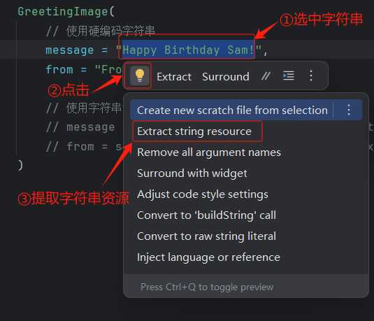

## a重组

既然有默认值，为什么还要传递 `Modifier` 实参。原因在于可组合函数可能会进行重组，这实质上意味着 `@Composable` 方法中的代码块会再次执行。如果在代码块中创建了 `Modifier` 对象，系统可能会重新创建该对象，并且这种方式效率不高。

[创建交互式 Dice Roller 应用](https://developer.android.google.cn/codelabs/basic-android-kotlin-compose-build-a-dice-roller-app?hl=zh-cn&continue=https%3A%2F%2Fdeveloper.android.google.cn%2Fcourses%2Fpathways%2Fandroid-basics-compose-unit-2-pathway-2%3Fhl%3Dzh-cn%23codelab-https%3A%2F%2Fdeveloper.android.com%2Fcodelabs%2Fbasic-android-kotlin-compose-build-a-dice-roller-app#2)


## 翻译

**将向用户显示的文本提取到字符串资源中，以便让应用更容易翻译成其他语言。**

硬编码字符串是直接写在应用代码中的字符串，会使得将应用翻译为其他语言的难度增大，在应用的不同位置重复使用字符串变得更困难。可以通过将字符串提取到资源文件中来解决这类问题。也就是说，您可以不必将字符串硬编码到代码中，而是将字符串放在文件中，并为这些字符串资源命名，然后在想要使用字符串时使用名称进行调用。即使更改了字符串或将其翻译成了其他语言，名称仍将保持不变。

同时，Android Studio 支持快速将硬编码字符串转换为字符串资源。



举个例子，`String` 数据类型是一连串的字符，例如 `"Happy Birthday Sam!"`。相关案例参考 [向 Android 应用添加图片](https://developer.android.google.cn/codelabs/basic-android-kotlin-compose-add-images?hl=zh-cn&continue=https%3A%2F%2Fdeveloper.android.google.cn%2Fcourses%2Fpathways%2Fandroid-basics-compose-unit-1-pathway-3%3Fhl%3Dzh-cn%23codelab-https%3A%2F%2Fdeveloper.android.com%2Fcodelabs%2Fbasic-android-kotlin-compose-add-images#6)

```kotlin
// 使用硬编码字符串
message = "Happy Birthday Sam!",
from = "From Emma"

// 使用字符串资源
message = stringResource(R.string.happy_birthday_text),
from = stringResource(R.string.signature_text)
```