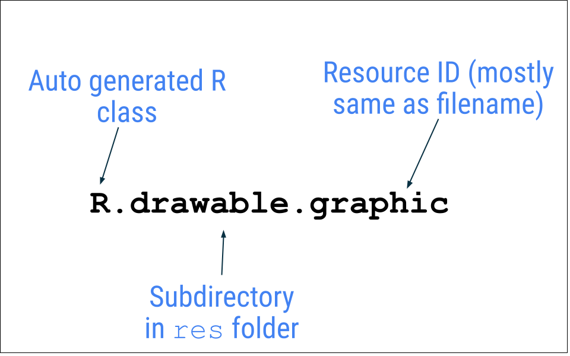

## 应用资源

资源是指代码使用的附加文件和静态内容，例如位图、界面字符串、动画说明等。如需详细了解 Android 中的资源，请参阅[应用资源概览](https://developer.android.google.cn/guide/topics/resources/providing-resources?hl=zh-cn)。

您应该始终将应用资源（如图片和字符串）与代码分隔开，以便能够独立地维护这些资源。在运行时，Android 会根据当前配置使用合适的资源。例如，您可能想根据屏幕尺寸提供不同的界面布局，或根据语言设置提供不同的字符串。

### 分组资源类型

将每种类型的资源放在项目的 `res/` 目录下的相应子目录中。例如，以下是一个简单项目的文件层次结构：

```
MyProject/
    src/
        MyActivity.java
    res/
        drawable/
            graphic.png
        layout/
            main.xml
            info.xml
        mipmap/
            icon.png
        values/
            strings.xml
```

`res/` 目录中包含存储在其子目录中的所有资源，包括存储图片资源的 `drawable/` 目录、存储布局的 `layout/`目录、 存储启动器图标的 `mipmap/` 目录和存储字符串资源的 `values/` 目录。

**资源目录名称非常重要**，具体说明请参见 https://developer.android.google.cn/guide/topics/resources/providing-resources?hl=zh-cn#ResourceTypes。


### 导入资源

使用 Android Studio 提供的 Resource Mangaer 来导入资源。


### 访问资源

在应用中提供资源后，您可通过**引用其资源 ID 来应用该资源**。资源 ID 始终由以下部分组成：

- 资源类型：每个资源都会被划分到相应的“类型”，例如 `string`、`drawable` 和 `layout`。如需详细了解不同的资源类型，请参阅[资源类型概览](https://developer.android.google.cn/guide/topics/resources/available-resources?hl=zh-cn)。
- 资源名称是不带扩展名的文件名，或 XML `android:name` 属性中的值（如资源是字符串等简单值）。

所有资源 ID 都在您项目的 `R` 类中进行定义，该类由 `aapt` 工具自动生成。编译应用时，`aapt` 会生成 `R` 类，其中包含 `res/` 目录中所有资源的资源 ID。每种类型的资源都有对应的 `R` 子类（例如，`R.drawable` 对应所有可绘制资源）。且相应类型的每个资源都有对应的静态整数（例如 `R.drawable.icon`）。该整型数就是可用来检索资源的资源 ID。

在大多数情况下，资源 ID 与文件名相同。例如，可以使用以下代码访问上面的文件层次结构中的图片：

```
R.drawable.graphic
```




### 密度限定符

`mdpi`、`hdpi`、`xhdpi` 等是密度限定符，您可以将其附加到资源目录的名称（例如 `mipmap,`）上，以表明其中的资源适用于特定屏幕密度的设备。

> 屏幕密度是指屏幕上每英寸的像素数或每英寸的点数 (dpi)。

以下是 Android 上的[密度限定符](https://developer.android.google.cn/training/multiscreen/screendensities?hl=zh-cn#TaskProvideAltBmp)列表：

- `mdpi` - 适用于中密度屏幕（约 160dpi）的资源
- `hdpi` - 适用于高密度屏幕（约 240dpi）的资源
- `xhdpi` - 适用于超高密度屏幕（约 320dpi）的资源
- `xxhdpi` - 适用于超超高密度屏幕（约 480dpi）的资源
- `xxxhdpi` - 适用于超超超高密度屏幕（约 640dpi）的资源
- `nodpi` - 不能缩放的资源（无论屏幕的像素密度是多少）
- `anydpi` - 可针对任何密度进行缩放的资源