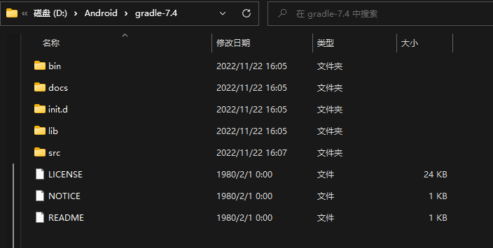
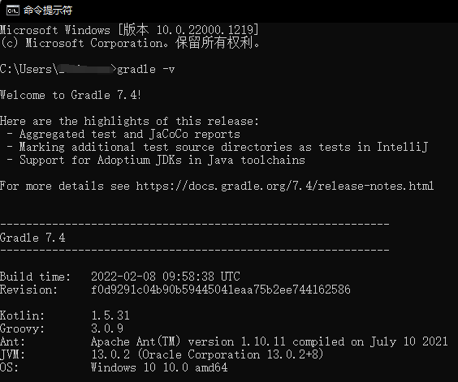
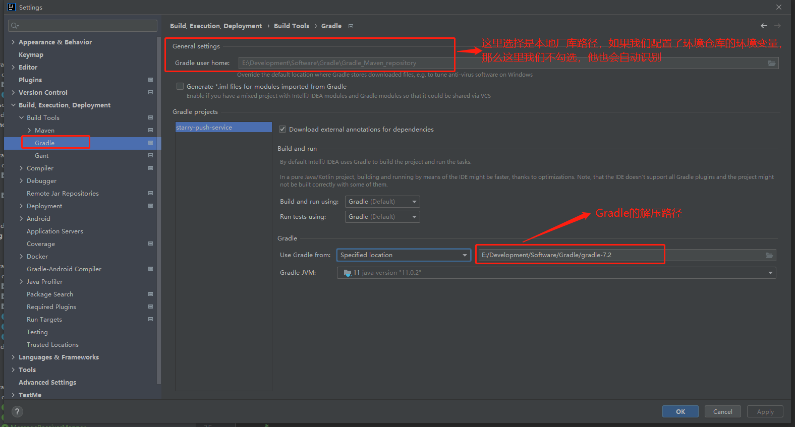
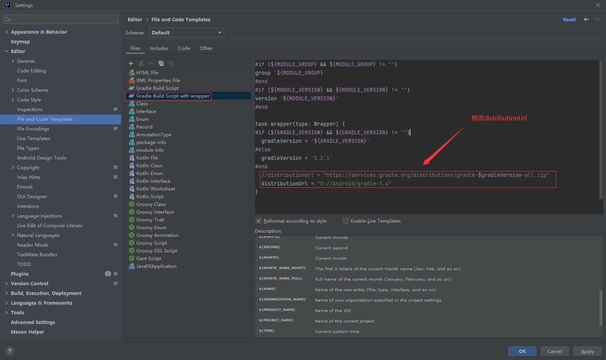
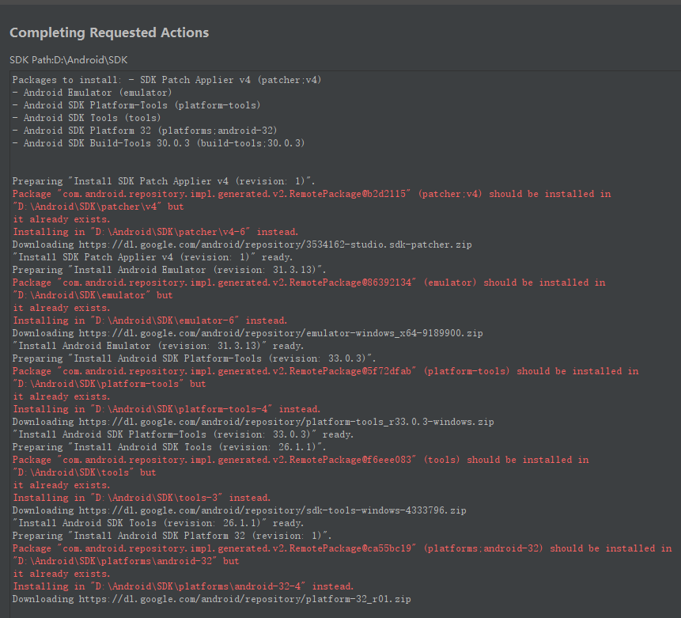

> [Gradle | Releases](https://gradle.org/releases/)

# 环境配置

1、下载[gradle](https://gradle.org/releases/) ， 然后解压到指定目录中



2、新建环境变量 GRADLE_HOME ：指向gradle安装路径

```
D:\Android\gradle-7.4
```

然后在 Path 环境变量 添加变量：

```
%GRADLE_HOME%\bin
```

3、验证gradle是否安装成功，打开cmd命令行输入：

```
gradle -v
```




# 仓库配置

## 配置仓库地址

1、新建文件夹（可以考虑取名为gradle-repository），用来当作gradle的仓库。文件路径为：

```
D:\Android\gradle-repository
```

2、新建环境变量`GRADLE_USER_HOME`, 该变量的含义是用来保存gradle下载的依赖包的 **本地仓库**目录 ， 变量值为：

```
D:\Android\gradle-repository
```


## 配置阿里云镜像

在gradle中的init.d文件夹📂（我的路径为`D:\Android\gradle-7.4\init.d`）里， 新建 init.gradle 文件 ， 并在该文件里面添加如下内容：

```
allprojects{
    repositories {
        def ALIYUN_REPOSITORY_URL = 'http://maven.aliyun.com/nexus/content/groups/public'
        def ALIYUN_JCENTER_URL = 'http://maven.aliyun.com/nexus/content/repositories/jcenter'
        all { ArtifactRepository repo ->
            if(repo instanceof MavenArtifactRepository){
                def url = repo.url.toString()
                if (url.startsWith('https://repo1.maven.org/maven2')) {
                    project.logger.lifecycle "Repository ${repo.url} replaced by $ALIYUN_REPOSITORY_URL."
                    remove repo
                }
                if (url.startsWith('https://jcenter.bintray.com/')) {
                    project.logger.lifecycle "Repository ${repo.url} replaced by $ALIYUN_JCENTER_URL."
                    remove repo
                }
            }
        }
        maven {
            url ALIYUN_REPOSITORY_URL
            url ALIYUN_JCENTER_URL
        }
    }
}
```


# IDEA配置

> [Gradle 配置 环境变量 [MD\] - 白乾涛 - 博客园 (cnblogs.com)](https://www.cnblogs.com/baiqiantao/p/6890674.html)

## 修改gradle配置

**gradle user home**其实是idea的项目从中央仓库下载jar包和Gradle环境还有其他配置文件的目录，这个目录默认是和GRADLE_USER_HOME同步的，所以我们并不需要修改gradle user home，**只需要在环境变量中加入GRADLE_USER_HOME即可自动修改gradle user home**



## 修改模板文件




