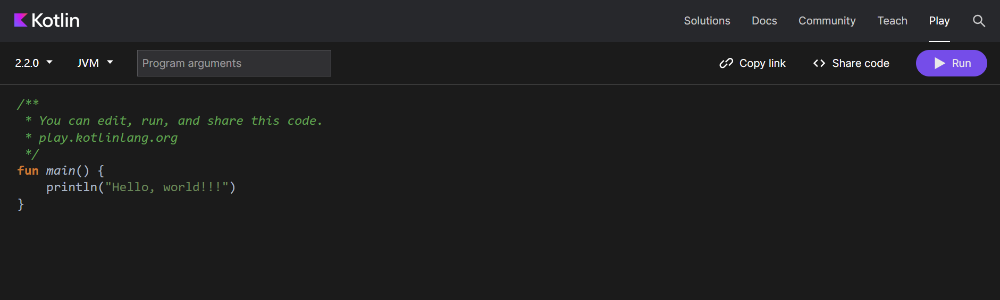

## 一、kolin 语言简介

### 1.1 什么是 kotlin 语言

kotlin 是由 

kolin 语言的特性如下：

- 相比于Java比较老旧的语法，Kotlin增加了很多现代高级语言的语法特性，使得开发效率大大提升
- 安全性：在语言安全性方面下了很多工夫，几乎杜绝了空指针这个全球崩溃率最高的异常，
- 是它和Java是100%兼 容的。Kotlin可以直接调用使用Java编写的代码，也可以无缝使用Java第三方的开源库。这使 得Kotlin在加入了诸多新特性的同时，还继承了Java的全部财富。

### 1.2 如何运行 Kolin 代码

第二种方法是在线运行Kotlin代码。为了方便开发者快速体验Kotlin编程，JetBrains专门提供 了一个可以在线运行Kotlin 代码网站 [Kotlin Playground: Edit, Run, Share Kotlin Code Online](https://play.kotlinlang.org/#eyJ2ZXJzaW9uIjoiMi4yLjAiLCJwbGF0Zm9ybSI6ImphdmEiLCJhcmdzIjoiIiwibm9uZU1hcmtlcnMiOnRydWUsInRoZW1lIjoiaWRlYSIsImNvZGUiOiIvKipcbiAqIFlvdSBjYW4gZWRpdCwgcnVuLCBhbmQgc2hhcmUgdGhpcyBjb2RlLlxuICogcGxheS5rb3RsaW5sYW5nLm9yZ1xuICovXG5mdW4gbWFpbigpIHtcbiAgICBwcmludGxuKFwiSGVsbG8sIHdvcmxkISEhXCIpXG59In0=)

同时，我们可以在[此处](https://developer.android.google.cn/kotlin/style-guide?hl=zh-cn)查看完整的 Kotlin 样式指南。

