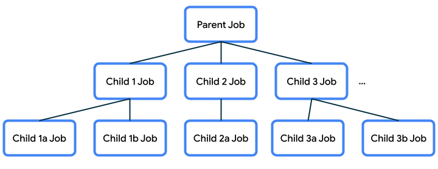

## 协程基本概念

协程 (coroutine) 中的

- “co-”是指“协同”。在代码挂起等待时（这使其他工作得以在此期间运行），代码协同工作以共享底层事件循环。（
- “-routine”部分表示一组指令，例如函数。

协程的一些优点：

- **可读性**：使用协程编写的代码可让您清楚了解执行代码行的顺序。
- **Jetpack 集成**：许多 Jetpack 库（例如 Compose 和 ViewModel）都包含提供全面协程支持的扩展。某些库还提供自己的协程作用域，可供您用于结构化并发。
- **结构化并发**：协程使得并发代码安全且易于实现，消除了不必要的样板代码，可确保应用启动的协程不会丢失或继续浪费资源。

### 结构化并发

异步或并发执行工作时，您需要回答一些问题，包括执行工作的方式、协程应存在的时长、协程取消或因错误而失败时应执行的操作等。协程遵循**结构化并发**原则，当您在结合使用不同机制的代码中使用协程时，这一原则会迫使您不得不回答这些问题。


**使用协程编写代码的方式称为结构化并发**。这种编程方式可以提高代码的可读性，并缩短开发时间。结构化并发的思路是，协程具有层次结构，任务可以启动子任务，子任务可以再启动子任务。这种层次结构的单位称为协程作用域。协程作用域应始终与生命周期相关联。


一个函数是同步函数还是异步函数取决于其组成部分。

并行分解是将一个问题分解成可以并行解决的更小的子任务。子任务的结果准备好之后，您可以将其合并为最终结果。

启动、完成、取消和失败是协程执行中的四个常见操作。为了更轻松地维护并发程序，结构化并发定义了一些原则，为如何在层次结构中管理通用操作奠定了基础：

1. **启动**：将协程启动到一个限定了协程存留时长的作用域中。
2. **完成**：只有在子作业完成后，作业才会完成。
3. **取消**：此操作需要向下传播。如果取消某个协程，那么也需要取消子协程。
4. **失败**：此操作应向上传播。如果协程抛出异常，那么父级会取消其所有子级，取消本身，并将异常向上传播到其父级。此过程会一直持续到捕获失败并进行处理为止。这可以确保正确报告代码中的所有错误，绝不错过任何错误。


### Job

Job 可管理协程的生命周期并维护父子关系，在确保结构化并发方面发挥着重要作用。

当您使用 `launch()` 函数启动协程时，它会返回一个 `Job` 实例。作业包含协程的句柄（即对协程的引用），因此您可以管理其生命周期。

```
val job = launch { ... }
```

**注意**：从以 `async()` 函数开头的协程返回的 `Deferred` 对象也是 `Job`，并且包含相应协程未来的结果。

此作业可用于控制协程的生命周期或持续时间，例如，在您不再需要相应任务时取消协程。

```
job.cancel()
```


### 作业层次结构

当一个协程启动另一个协程时，从新协程返回的作业称为原始父作业的子级。

```
val job = launch {
    ...            

    val childJob = launch { ... }

    ...
}
```

这些父级与子级关系形成了作业层次结构，其中的每个作业都可以启动其他作业，依此类推。



**这种父级与子级关系很重要，因为它会规定子级和父级以及属于同一个父级的其他子级的某些行为**。您在之前的天气程序示例中见过这种行为。

- 如果某个父作业被取消，那么其子作业也会被取消。
- 使用 `job.cancel()` 取消某个子作业时，该子作业会终止，但其父级不会被取消。
- 如果某个作业失败并引发异常，其父级中具有该异常的作业也会被取消。这称为错误向上传播（到父级、父级的父级，依此类推）。


## **CoroutineScope**

`CoroutineScope` 通过其 Job 来控制协程的生命周期，并以递归方式对其子级和子级的子级执行取消和其他规则。因此，协程通常启动到  [`CoroutineScope.kt`](https://cs.android.com/android/platform/superproject/+/master:external/kotlinx.coroutines/kotlinx-coroutines-core/common/src/CoroutineScope.kt?q=coroutinescope&hl=zh-cn)  中。这可以确保没有不受管理而不知所踪的协程，因此不会浪费资源。

`launch()` 和 `async()` 是 `CoroutineScope` 的[扩展函数](https://kotlinlang.org/docs/extensions.html)。对该作用域调用 `launch()` 或 `async()`，以在该作用域内创建新协程，此子级还会从该作用域继承上下文。

`CoroutineScope` 与生命周期相关联，生命周期对该作用域内的协程存留时长设置了界限。如果某个作用域被取消，那么其作业也会被取消，而且取消会传播到其子作业。如果作用域内的某个子作业失败并引发异常，那么其他子作业会被取消，父作业也会被取消，而且会向调用方重新抛出异常。


## **CoroutineContext**

`CoroutineContext` 提供将在其中运行协程的上下文的相关信息。`CoroutineContext` 本质上是一个用于存储元素的映射，其中的每个元素都有一个唯一的键。这些并非必填字段，不过下面列举了一些上下文中可能包含的字段：

- name - 协程的名称，用于唯一标识协程
- job - 控制协程的生命周期
- dispatcher - 将工作分派到适当的线程
- exception handler - 处理协程中执行的代码所抛出的异常

上下文中的每个元素可以通过 `+` 运算符加到一起。例如，可以如下定义一个 `CoroutineContext`：

```
Job() + Dispatchers.Main + exceptionHandler
```

由于未提供名称，因此使用了默认的协程名称。

如果在协程中启动一个新协程，子协程将从父协程继承 `CoroutineContext`，但只会为刚创建的协程替换作业。您也可以替换从父上下文继承的任何元素，只需针对上下文中您希望更改的部分向 `launch()` 或 `async()` 函数传入参数即可。

```
scope.launch(Dispatchers.Default) {
    ...
}
```

您可以观看此 [KotlinConf 会议讲座视频](https://youtu.be/w0kfnydnFWI?t=256)，详细了解 `CoroutineContext` 以及如何从父级继承上下文。


### 调度程序

协程使用调度程序来确定用于执行协程的线程。**线程**可以启动、执行一些工作（执行一些代码），然后在没有更多工作要完成时终止。

当用户启动您的应用时，Android 系统会为您的应用创建一个新进程和一个执行线程（称为**主线程**）。主线程负责为应用处理许多重要的操作，包括 Android 系统事件、在屏幕上绘制界面、处理用户输入事件等。因此，您为应用编写的大多数代码可能都在主线程上运行。

**对于 Android 应用，只有当主线程执行速度非常快时，您才能对主线程调用阻塞代码**。目的是让主线程保持未阻塞状态，以便主线程能够在触发新事件时立即执行工作。主线程是 activity 的**界面线程**，负责界面绘制和界面相关事件。当屏幕发生变化时，需要重新绘制界面。对于屏幕上的某些元素（例如动画），界面需要频繁地重新绘制，以使这些元素具有平滑过渡效果。如果主线程需要执行长时间运行的工作块，屏幕更新频率就会下降，用户就会看到生硬的过渡（称为“卡顿”），或者应用可能会挂起或响应缓慢。

因此，我们需要**将任何长时间运行的工作项移出主线程，在其他线程中进行处理**。应用开始时只有一个主线程，但您可以选择创建多个线程来执行其他工作。这些额外的线程可以称为工作器线程。长时间运行的任务如果长时间阻塞工作线程，是完全没有问题的，因为在此期间，主线程会保持畅通，可以积极响应用户。

如果您有在主线程上启动的协程，并且您希望将某些操作移出主线程，就可以使用 `withContext` 切换用于相应工作的调度程序。Kotlin 提供了一些内置调度程序：

- **Dispatchers.Main:**：使用此调度程序可在 Android 主线程上运行协程。此调度程序主要用于处理界面更新和互动以及执行快速工作。
- **Dispatchers.IO:**：此调度程序经过了专门优化，适合在主线程之外执行磁盘或网络 I/O。例如，读取或写入文件以及执行任何网络操作。
- **Dispatchers.Default:**：在调用 `launch()` 和 `async()` 时，如果其上下文中未指定调度程序，就会使用此默认调度程序。您可以使用此调度程序在主线程之外执行计算密集型工作。例如，处理位图图片文件。

```
import kotlinx.coroutines.*

fun main() {
    runBlocking {
        println("${Thread.currentThread().name} - runBlocking function")
        launch {
            println("${Thread.currentThread().name} - launch function")
            withContext(Dispatchers.Default) {
                println("${Thread.currentThread().name} - withContext function")
                delay(1000)
                println("10 results found.")
            }
            println("${Thread.currentThread().name} - end of launch function")
        }
        println("Loading...")
    }
}
```

运行程序。输出应如下所示：

```
main @coroutine#1 - runBlocking function
Loading...
main @coroutine#2 - launch function
DefaultDispatcher-worker-1 @coroutine#2 - withContext function
10 results found.
main @coroutine#2 - end of launch function
```

根据此输出可以发现，

- [`withContext()`](https://kotlinlang.org/api/kotlinx.coroutines/kotlinx-coroutines-core/kotlinx.coroutines/with-context.html) 本身是一个挂起函数。它使用新的 `CoroutineContext` 执行提供的代码块。新的上下文来自父作业的上下文（外部 `launch()` 块），但它会将父上下文中使用的调度程序替换为此处指定的调度程序：`Dispatchers.Default`。如此一来，我们就能从使用 `Dispatchers.Main` 执行工作改为使用 `Dispatchers.Default`。

- 大部分代码是在主线程上的协程中执行的。不过，`withContext(Dispatchers.Default)` 块中的这部分代码是在一个默认调度程序工作器线程（它不是主线程）上的协程中执行的。请注意，在 `withContext()` 返回后，协程会返回到在主线程上运行（输出语句 `main @coroutine#2 - end of launch function` 表明了这一点）。此示例证明，您可以通过修改用于协程的上下文来切换调度程序。


## 同步和异步

### 挂起函数

**挂起**函数与常规函数类似，只不过它可以挂起并于稍后恢复。

函数声明中的 `fun` 关键字前面添加 `suspend` 修饰符

挂起函数只能从协程或其他挂起函数中调用。此限制可确保您从协程构建器中（例如 `launch`）调用挂起函数。这些构建器反过来又会与 `CoroutineScope` 相关联。


`delay()` 函数


### 同步代码

协程库中提供的 `runBlocking()` 同步函数用于运行一个事件循环，该事件循环可在每项任务准备好恢复时从中断处继续执行任务，因此可以同时处理多项任务。

```
import kotlinx.coroutines.*

fun main() {
    runBlocking {
        println("Weather forecast")
        printForecast()
    }
}

suspend fun printForecast() {
    delay(1000)
    println("Sunny")
}
```

> **注意**：一般而言，只有出于学习目的才会像这样在 `main()` 函数中使用 `runBlocking()`。在 Android 应用代码中，您不需要使用 `runBlocking()`，因为 Android 会为应用提供一个事件循环，用于在工作可以恢复时处理恢复的工作。不过，`runBlocking()` 在测试中比较实用，可以让测试等到应用中的特定条件达到后再调用测试断言。


### 异步代码

Kotlin 中的协程遵循名为[**结构化并发**](https://kotlinlang.org/docs/coroutines-basics.html#structured-concurrency)的关键概念，即**除非您明确要求并发执行（例如，使用 `launch()`），否则代码在默认情况下依序执行并与底层事件循环协同工作**。此原则假定，如果您调用一个函数，那么无论该函数在实现细节中使用了多少协程，都应在彻底完成其工作后再返回。即使因异常而失败，一旦系统抛出异常，该函数也不再有待处理的任务。因此，在函数返回控制流后，所有工作都会完成，无论函数抛出异常还是成功完成工作都是如此。

(1)  `launch()` 函数

协程库中的 `launch()` 函数启动一个新协程。如需并发执行任务，请向代码中添加多个 `launch()` 函数，以便多个协程可以同时执行。

```kotlin
import kotlinx.coroutines.*

fun main() {
     runBlocking {
        println("Weather forecast")
        launch {
            printForecast()
        }
        launch {
            printTemperature()
        }
        println("Have a good day!")
    }
}

suspend fun printForecast() {
    delay(1000)
    println("Sunny")
}

suspend fun printTemperature() {
    delay(1000)
    println("30\u00b0C")
} 
```

运行程序。输出内容如下：

```
Weather forecast
Have a good day!
Sunny
30°C
```

根据此输出可以发现，启动 `printForecast()` 和 `printTemperature()` 的两个新协程后，您可以继续执行用于输出 `Have a good day!` 的下一个指令。这表现了 `launch()` 具有“触发后不理”的性质。您可以使用 `launch()` 触发一个新协程，而无需担心其工作何时完成。

(2) `async()` 函数

如果您关心协程何时完成并需要从中返回的值，请使用协程库中的 `async()` 函数。

`async()` 函数会返回一个类型为 `Deferred` 的对象，就好像在承诺结果准备就绪后就会出现在其中。您可以使用 `await()` 访问 `Deferred` 对象上的结果。

> 作为 `async(),` 的真实示例，您可以查看 [Now in Android 应用](https://github.com/android/nowinandroid)的这一部分。在 [SyncWorker](https://github.com/android/nowinandroid/blob/main/sync/work/src/main/java/com/google/samples/apps/nowinandroid/sync/workers/SyncWorker.kt#L65) 类中，如果与特定后端同步成功，那么对 `sync()` 的调用会返回一个布尔值。如果任何同步操作失败，应用就需要执行重试。

示例如下：

```kotlin
import kotlinx.coroutines.*

fun main() {
    runBlocking {
        println("Weather forecast")
        // 将每个 async() 调用的返回值存储在名为 forecast 和 temperature 的变量
        val forecast: Deferred<String> = async {
            getForecast()
        }
        val temperature: Deferred<String> = async {
            getTemperature()
        }
        
        // getForecast()和getTemperature()的返回值存储后才能调用该语句
        println("${forecast.await()} ${temperature.await()}")
        println("Have a good day!")
    }
}

suspend fun getForecast(): String {
    delay(1000)
    return "Sunny"
}

suspend fun getTemperature(): String {
    delay(1000)
    return "30\u00b0C"
}
```

运行程序，输出内容应如下所示：

```
Weather forecast
Sunny 30°C
Have a good day!
```

两个并发运行的协程来获取天气预报和温度数据。每个协程完成时，都会返回一个值。然后，您将这两个返回值合并为一个输出语句：`Sunny 30°C`。


**(3)`coroutineScope{}` 函数**

`coroutineScope()` 仅在其所有工作（包括其启动的所有协程）完成后才会返回。

示例如下：

```kotlin
import kotlinx.coroutines.*

fun main() {
    runBlocking {
        println("Weather forecast")
        println(getWeatherReport())
        println("Have a good day!")
    }
}

suspend fun getWeatherReport() = coroutineScope {
    val forecast = async { getForecast() }
    val temperature = async { getTemperature() }
    "${forecast.await()} ${temperature.await()}"
}

suspend fun getForecast(): String {
    delay(1000)
    return "Sunny"
}

suspend fun getTemperature(): String {
    delay(1000)
    return "30\u00b0C"
}
```

运行程序，您会看到以下输出：

```
Weather forecast
Sunny 30°C
Have a good day!
```

在此例中，`coroutineScope{}` 用于为此天气预报任务创建局部作用域。在此作用域内启动的协程会归入此作用域内，这对取消和异常都会产生影响。在 `coroutineScope()` 的主体中，协程 `getForecast()` 和 `getTemperature()` 都需要完成并返回各自的结果。然后，系统会合并 `Sunny` 文本和 `30°C` 并将其从该作用域中返回。系统会输出此天气预报（即 `Sunny 30°C`），调用方可继续执行用于输出 `Have a good day!` 的最后一个 print 语句。


## 协程异常处理


### 异常传播方式

除非得到处理，否则异常将在协程树中向上传播。此外，如果异常会一直传播到层次结构的根部，也请务必小心，因为这可能会导致整个应用崩溃。如需详细了解如何处理异常，请参阅[协程中的异常](https://medium.com/androiddevelopers/exceptions-in-coroutines-ce8da1ec060c)这篇博文和[协程异常处理](https://kotlinlang.org/docs/exception-handling.html)一文。

> 对于以 `launch()` 开头的协程与以 `async()` 开头的协程，异常的传播方式有所不同。在以 `launch()` 开头的协程内，系统会立即抛出异常。因此，如果预计代码会抛出异常，您可以使用 try-catch 块将代码括起来。查看[示例](https://developer.android.google.cn/kotlin/coroutines?hl=zh-cn#handling-exceptions)。


### 协程错误处理机制

(1) 不恰当的做法

```kotlin
import kotlinx.coroutines.*

fun main() {
    runBlocking {
        println("Weather forecast")
        try {
            println(getWeatherReport())
        } catch (e: AssertionError) {
            println("Caught exception in runBlocking(): $e")
            println("Report unavailable at this time")
        }
        println("Have a good day!")
    }
}

suspend fun getWeatherReport() = coroutineScope {
    val forecast = async { getForecast() }
    val temperature = async { getTemperature() }
    "${forecast.await()} ${temperature.await()}"
}

suspend fun getForecast(): String {
    delay(1000)
    return "Sunny"
}

suspend fun getTemperature(): String {
    delay(500)
    throw AssertionError("Temperature is invalid")	// 主动抛出异常
    return "30\u00b0C"
}
```

运行程序，现在，系统会妥善处理错误，程序也能成功完成执行。

```
Weather forecast
Caught exception in runBlocking(): java.lang.AssertionError: Temperature is invalid
Report unavailable at this time
Have a good day!
```

从输出结果可以看出，`getTemperature()` 会抛出异常。在 `runBlocking()` 函数的主体中，将 try-catch 块中的 `println(getWeatherReport())` 调用括起来。您可以捕获预期的异常类型（本例中为 `AssertionError`）。然后，您将异常作为 `"Caught exception"` 输出到输出结果，后跟错误消息字符串。为了处理该错误，您需要使用额外的 `println()` 语句告知用户天气预报不可用：`Report unavailable at this time`。

请注意，这种行为意味着，**如果无法获取温度信息，便无法发布任何天气预报**（即使检索了有效的预报信息也是如此）

> **警告**：在协程代码中的 try-catch 语句中，请避免捕获常规 `Exception`，因为这包含的异常极多。您可能会无意中捕获并抑制某个错误，而实际上这个错误属于代码中应该予以修复的 bug。另一个重要原因是，协程的取消（参见下文）依赖于 [`CancellationException`](https://kotlinlang.org/docs/exception-handling.html#cancellation-and-exceptions)。因此，如果您捕获任何类型的 `Exception`（包括 `CancellationExceptions`）而不重新将其抛出，协程内的取消行为便可能与预期不同。不过，您可以捕获预计会从代码中抛出的特定类型的异常。

(2) 移动错误处理机制

**移动错误处理机制，让 try-catch 行为实际发生在由 `async()` 启动的协程内**，以提取温度信息。这样，即使未提取到温度信息，天气预报仍可输出预报信息。

```kotlin
import kotlinx.coroutines.*

fun main() {
    runBlocking {
        println("Weather forecast")
        println(getWeatherReport())
        println("Have a good day!")
    }
}

suspend fun getWeatherReport() = coroutineScope {
    val forecast = async { getForecast() }
    val temperature = async {
        try {
            getTemperature()
        } catch (e: AssertionError) {
            println("Caught exception $e")
            "{ No temperature found }"
        }
    }

    "${forecast.await()} ${temperature.await()}"
}

suspend fun getForecast(): String {
    delay(1000)
    return "Sunny"
}

suspend fun getTemperature(): String {
    delay(500)
    throw AssertionError("Temperature is invalid")
    return "30\u00b0C"
}
```

运行程序。

```
Weather forecast
Caught exception java.lang.AssertionError: Temperature is invalid
Sunny { No temperature found }
Have a good day!
```

从输出结果可以看出，调用 `getTemperature()` 因出现异常而失败，但 `async()` 中的代码可以捕获相应异常并妥善加以处理，只需让协程仍然返回表示未找到温度信息的 `String` 即可。系统仍可输出天气预报，并成功预报 `Sunny`。天气预报中缺少温度信息，但在用于显示温度信息的位置将显示一条消息，以说明未找到温度信息。与程序因此错误而崩溃相比，这种用户体验更好。


### 取消协程

“协程的取消”这一主题与异常类似。当某个事件导致应用取消其先前启动的工作时，这种场景通常是由用户驱动的。**协程可以取消，但不会影响同一作用域内的其他协程，并且父协程不会取消**。

> **注意**：如需详细了解如何[取消协程](https://medium.com/androiddevelopers/cancellation-in-coroutines-aa6b90163629)，请参阅这篇 Android 开发者博文。取消操作必须协同工作，因此您应实现协程，这样才能将其取消。

例如，假设用户在应用中选择了一项偏好设置，以指示自己不想在应用中再看到温度值了。他们只想知道天气预报信息（例如 `Sunny`），但不想知道确切温度。因此，要取消目前用于获取温度数据的协程。

```kotlin
import kotlinx.coroutines.*

fun main() {
    runBlocking {
        println("Weather forecast")
        println(getWeatherReport())
        println("Have a good day!")
    }
}

suspend fun getWeatherReport() = coroutineScope {
    val forecast = async { getForecast() }
    val temperature = async { getTemperature() }
    
    delay(200)
    temperature.cancel()

    "${forecast.await()}"
}

suspend fun getForecast(): String {
    delay(1000)
    return "Sunny"
}

suspend fun getTemperature(): String {
    delay(1000)
    return "30\u00b0C"
}
```

运行程序。现在，输出结果将如下所示。天气预报只包含天气预报信息 `Sunny`，但不包含温度，因为相应协程已取消。

```
Weather forecast
Sunny
Have a good day!
```

