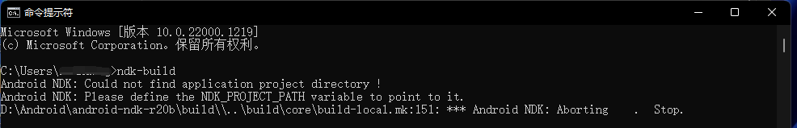
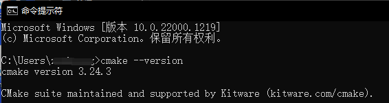

# 环境配置说明

NDK：Android原生开发套件

CMAKE：外部编译工具

LLDB：原生代码调试工具

> 具体的位置在settings->Appearance&Behavior->System Settings->Android SDK->SDK Tools中，值得注意的是，在比较高版本的IDEA中，LLDB已经内置在工具中，所以当你在SDK Tools中找不到LLDB工具时，说明你的工具已经自带了，无需自行安装；


# 相关概念

> 原文链接：https://blog.csdn.net/u014720022/article/details/92842193

Q1：**什么是NDK？**
A1： NDK的全称是Native Development Kit， 是一套工具原生开发套件，使你能够在 Android 应用中使用 C 和 C++ 代码，并提供众多平台库，你可使用这些平台库管理原生 Activity 和访问物理设备组件，例如传感器和轻触输入。
Q2：**为什么使用NDK？**
A2： 当我们需要完成以下一个或多个事项，那么 NDK 就能派上用场：
提高应用的执行效率。将要求高性能的应用逻辑使用C开发，从而提高应用程序的执行效率。
代码的保护。由于apk的java层代码很容易被反编译，而C/C++库反汇难度较大。
可以方便地使用现存的开源库。大部分现存的开源库都是用C/C++代码编写的。
便于移植。用C/C++写得库可以方便在其他的嵌入式平台上再次使用。
Q3：**什么是JNI？**
A3： JNI的全称是Java Native Interface，是一个 Java 原生接口框架，它提供了若干的API实现了Java和其他语言的通信（主要是C和C++）。
Q4：**为什么要使用JNI？**
A4： Java 代码通过JNI框架就可以直接调用原生库中的函数。
Q5：**so文件是什么？**
A5： android中用到的so文件是一个c++的函数库。在android的JNI中，要先将相应的C/C++语言打包成so库，然后导入到lib文件夹中供java调用。


# NDK环境配置

> [NDK环境搭建-windows篇_冠切云之崔嵬的博客-CSDN博客](https://blog.csdn.net/sinat_33231573/article/details/109027343)
>
> [历史版本下载位置](https://github.com/android/ndk/wiki/Unsupported-Downloads)

1、下载版本为 android-ndk-r20b-windows-x86_64 的文件

2、配置环境变量：直接在PATH变量中添加

```
D:\Android\android-ndk-r20b
```

> 注意：安装路径中**不能出现空格**，否则验证安装成功时会报错。错误案例：D:\Program Files\android-ndk-r20b 

3、验证是否安装成功： `ndk-build`




# CMAKE环境配置

> [CMake官网下载地址](https://cmake.org/download/)
>
> [镜像网站](https://cmake.org/files/v3.24/)

1、下载版本为 cmake-3.24.3-windows-x86_64 的文件

2、配置环境变量: ：直接在PATH变量中添加

```
D:\Android\cmake-3.24.3-windows-x86_64\bin
```

3、验证是否安装成功： `cmake --version`




# Android Studio


android的ndk路径设置

```
ndk.dir=E\:\\thirdparty\\Android\\android-ndk-r21e-windows-x86_64\\android-ndk-r21e
```

不能直接在settings里面修改，坑地一批


# 参考教程

[Android NDK 简介及环境配置（一）_BroganGrow的博客-CSDN博客](https://blog.csdn.net/u014720022/article/details/92842193)

[NDK开发环境配置](https://www.jianshu.com/p/768b47ee5ebf)